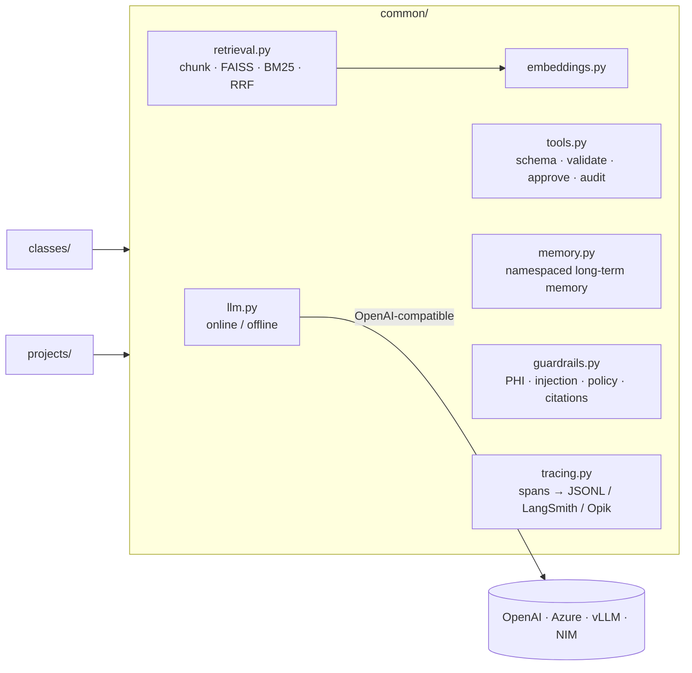

# Building Enterprise AI Agents — Complete Course System

A six-week, twelve-class program with runnable code. Every class has a lesson, a worked example, an architecture diagram, a process-flow diagram, code, and a lab. Four capstone projects in regulated and operational domains run through the course:

| Capstone | Domain | Pattern | Key techniques |
|---|---|---|---|
| [Clinical Prior-Authorization Assistant](backend/projects/clinical_prior_auth/README.md) | Healthcare | LangGraph workflow + human review | PHI redaction, policy RAG, LLM extraction → rules engine, physician-only denials, audit |
| [Legal Contract Review Agent](backend/projects/legal_contract_review/README.md) | Legal | Map-reduce over clauses | Playbook as code, parallel `Send`, redlines, counsel escalation, injection screening |
| [AIOps Operations Agents](backend/projects/aiops_agents/README.md) | IT operations | Supervisor + 4 specialist agents | Alert correlation, dependency-graph RCA, runbook RAG, change policy, approvals, postmortems |
| [Inventory Planner](backend/projects/inventory_planner/README.md) | Supply chain | Peer agents over A2A | Agent Cards, `input-required`, safety stock, budget allocation, Docker + Azure |

> All patients, contracts, telemetry and suppliers are **synthetic**. Nothing here is medical or legal advice.

## Curriculum

| Week | Class | Example domain | Code |
|---|---|---|---|
| 1 Foundations | [1 Introduction to Agentic AI](backend/classes/class01_intro_agentic_ai/README.md) | Clinical intake | ReAct loop from scratch + LangGraph |
| | [2 Prompt Engineering and Designing Agents](backend/classes/class02_prompt_engineering/README.md) | Legal clauses | Versioned prompts, structured output, DSPy |
| 2 Retrieval | [3 Embeddings and RAG](backend/classes/class03_embeddings_rag/README.md) | Clinical policies | Chunking, FAISS, grounded answers |
| | [4 RAG Design](backend/classes/class04_rag_design/README.md) | Legal corpus | Chroma, BM25, RRF, rerank, self-query, recall/MRR |
| 3 Tools & Memory | [5 Tool Engineering](backend/classes/class05_tool_engineering/README.md) | AIOps | Typed tools, validation, interrupts, idempotency |
| | [6 Memory in Agents, MCP](backend/classes/class06_memory_mcp/README.md) | AIOps + clinical | FastMCP server/client, checkpointer, long-term memory |
| 4 Evaluation | [7 Evaluating your Agent](backend/classes/class07_evaluation/README.md) | Clinical RAG + AIOps | Eval harness, regression gate, trajectories, LangSmith/Opik |
| | [8 Error Analysis, LLM as Judge](backend/classes/class08_error_analysis_judge/README.md) | Legal Q&A | Failure taxonomy, rubric judge, Cohen's κ |
| 5 Advanced | [9 Agentic RAG + Fine-tuning](backend/classes/class09_agentic_rag_finetuning/README.md) | Clinical | CRAG/Self-RAG graph, SFT/DPO data, NeMo LoRA |
| | [10 Inference Optimization](backend/classes/class10_inference_optimization/README.md) | Mixed traffic | Routing, semantic cache, context budgets, vLLM, load tests |
| 6 Production | [11 Observability and Guardrails](backend/classes/class11_observability_guardrails/README.md) | Clinical PHI | Tracing, OTel, layered guardrails |
| | [12 Case Study: Inventory Planner; A2A, Deployment, Change Management](backend/classes/class12_inventory_a2a_deployment/README.md) | Supply chain | A2A on the wire, Azure Container Apps, change kit |

## Quick start

```bash
python -m venv .venv && source .venv/bin/activate
pip install -r requirements.txt

# Run the complete system (Backend API + Web UI)
python backend/run.py
```

- **Course Web UI**: [http://localhost:8000](http://localhost:8000)
- **Interactive Swagger Docs**: [http://localhost:8000/docs](http://localhost:8000/docs)

## Repository Map

```
frontend/        modern Single-Page Application (HTML5 / CSS3 / Vanilla JS)
backend/         FastAPI service, models, routes, plus complete course components:
  ├── main.py    FastAPI application, CORS, static mounting, routers
  ├── run.py     backend entrypoint script
  ├── common/    shared building blocks: LLM client, embeddings, retrieval, tools, memory, guardrails
  ├── data/      synthetic datasets: clinical policies + PA, contracts, telemetry, inventory
  ├── classes/   12 lessons: README (concepts, diagrams, lab) + runnable examples
  ├── projects/  4 capstones: code, API, Dockerfile, README with architecture + process flow
  └── tests/     pytest suite covering the shared core, classes and capstones
```

## Architecture of the shared core


