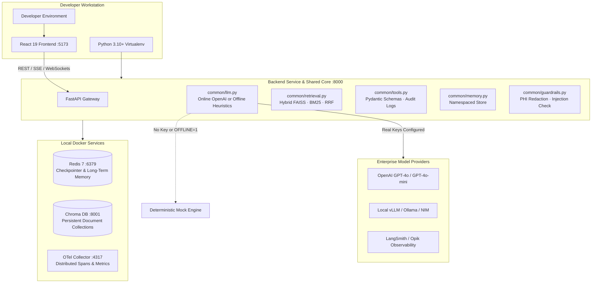

# Class 0 — Prerequisites & Environment Setup

**Week 0 · Prerequisites**

* **Domain Example:** Enterprise Workstation & Infrastructure Provisioning
* **Tools & Frameworks:** Python 3.10+, Virtualenv, LangGraph, FAISS, Chroma DB, Docker, Redis, Model Context Protocol (MCP)

---

## Learning Objectives

- Set up a production-grade development workstation for enterprise agentic engineering across Windows, macOS, and Linux.
- Provision isolated virtual environments, manage tiered package dependencies, and avoid schema incompatibilities.
- Configure secure multi-provider credential management with seamless zero-cost offline deterministic mock fallbacks.
- Initialize in-memory and persistent vector search backends (`faiss-cpu`, `chromadb`, `rank-bm25`).
- Deploy local infrastructure services via Docker Compose for durable graph checkpointing (Redis) and distributed telemetry (OpenTelemetry).
- Run automated diagnostic self-tests to validate vector similarity math, LangGraph compilation, and tool calling loops before writing agent code.

---

## 1. System Requirements & Workstation Matrix

| Component | Minimum Specification | Recommended Enterprise Spec | Notes |
|---|---|---|---|
| **Operating System** | Windows 10/11, macOS 12+, Ubuntu 22.04 LTS | Windows 11 with WSL2, macOS (Apple Silicon M1/M2/M3), Ubuntu 24.04 | Native Windows PowerShell 7 and Unix bash are both fully supported. |
| **Python Runtime** | Python 3.10.x | Python 3.11.x or 3.12.x | Python 3.13 is not yet recommended due to C-extension build limits in some vector packages. |
| **Node.js & npm** | Node.js v18.x LTS | Node.js v20.x or v22.x LTS | Powers the React 19 course frontend and interactive code/lab workspace. |
| **Memory (RAM)** | 8 GB | 16 GB – 32 GB | In-memory embeddings and local LangGraph graphs run smoothly in 8 GB; local LLM serving (vLLM) benefits from 16 GB+. |
| **Disk Space** | 5 GB free disk space | 15 GB+ SSD | Accommodates virtual environment, vector indices, and optional Docker container images. |
| **Container Engine** | Optional (offline mock available) | Docker Desktop 24+ or Podman | Required for running Redis checkpointers, Chroma standalone, and Capstone deployments. |
| **Git** | Git 2.30+ | Git 2.40+ with LF line-ending normalization | Essential for course versioning and diff inspections. |

---

## 2. Architecture Blueprint

The entire course architecture is engineered around the **Shared Core pattern**. Every lesson and capstone project imports modular building blocks (`llm`, `retrieval`, `memory`, `guardrails`, `tools`, `tracing`) from `backend/common/`:



---

## 3. Step-by-Step Installation & Setup

### Step 3.1: Clone & Navigate to Repository

```bash
# Clone the repository
git clone https://github.com/utkarshraj-gif/Agentic_Course.git
cd agentic-ai-course
```

### Step 3.2: Create and Activate Python Virtual Environment

Isolating dependencies ensures fast-evolving agent libraries (such as Pydantic, LangChain, and LangGraph) do not collide with global system packages:

**On Windows (PowerShell):**
```powershell
python -m venv .venv
.\.venv\Scripts\Activate.ps1
```
*(If you see an execution policy error on PowerShell, run `Set-ExecutionPolicy -Scope Process -ExecutionPolicy Bypass` first).*

**On macOS / Linux (Bash or Zsh):**
```bash
python3 -m venv .venv
source .venv/bin/activate
```

### Step 3.3: Install Python Dependencies

The course dependencies are structured in tiers in `requirements.txt`:

```bash
# Upgrade pip, setuptools, and wheel
python -m pip install --upgrade pip setuptools wheel

# Install core tier (enables complete offline curriculum, FastAPI backend, and vector math)
pip install -r requirements.txt
```

#### Optional Tiered Additions:
```bash
# For real model inference and prompt optimization (Classes 1–2):
pip install langchain-openai dspy

# For persistent memory backends (Class 6):
pip install redis langmem

# For automated evaluations and tracing (Classes 7 & 11):
pip install langsmith opik opentelemetry-sdk opentelemetry-exporter-otlp
```

### Step 3.4: Install & Launch Frontend

The course comes with a single-page interactive UI (built with React 19, TypeScript, and Vite):

```bash
cd frontend-react
npm install
npm run dev
```
The React learning portal will be available at `http://localhost:5173`.

### Step 3.5: Run the Backend API

In a separate terminal (with `.venv` activated):

```bash
python -m uvicorn backend.main:app --host 127.0.0.1 --port 8000 --reload
```
Interactive Swagger API documentation will be available at `http://127.0.0.1:8000/docs`.

---

## 4. Course-Wide Dependency & Technology Map

| Week & Class | Primary Focus | Required Packages | Optional Online Integrations | Offline Capable? |
|---|---|---|---|---|
| **Class 0** | Prerequisites & Environment Setup | `pydantic`, `fastapi`, `markdown`, `httpx` | `docker`, `redis` | **Yes (100%)** |
| **Class 1** | Intro to Agentic AI & ReAct Loops | `langchain-core`, `langgraph` | `openai`, `langchain-openai` | **Yes** (Built-in offline planner) |
| **Class 2** | Prompt Engineering & Structured State | `pydantic>=2.7`, `dspy` | `openai` | **Yes** (JSON schema fallbacks) |
| **Class 3** | Embeddings & Dense Retrieval | `faiss-cpu`, `numpy` | `openai` (`text-embedding-3-small`) | **Yes** (Deterministic hash embeddings) |
| **Class 4** | RAG Design: Hybrid & Reranking | `chromadb`, `rank-bm25`, `scikit-learn` | Reciprocal Rank Fusion (RRF) | **Yes** (Local in-memory Chroma) |
| **Class 5** | Tool Engineering & Interrupts | `pydantic`, `langgraph` | Function calling APIs | **Yes** (Offline schema validator) |
| **Class 6** | Memory in Agents & FastMCP | `mcp>=1.2`, `langgraph` | `redis`, `langmem` | **Yes** (In-memory checkpointer) |
| **Class 7** | Evaluating Agents & Trajectories | `pytest`, `httpx` | `langsmith`, `opik` | **Yes** (Local JSONL trace evaluator) |
| **Class 8** | Error Analysis & LLM as Judge | `scikit-learn`, `numpy` | `openai` | **Yes** (Rubric calibration suite) |
| **Class 9** | Agentic RAG & Fine-Tuning | `langgraph` | `nemo_toolkit`, OpenAI SFT | **Yes** (CRAG / Self-RAG graph) |
| **Class 10** | Inference Optimization & Caching | `httpx` | `vllm`, semantic cache | **Yes** (Token bucket simulator) |
| **Class 11** | Observability & PHI Guardrails | `pydantic` | `opentelemetry-sdk`, `opik` | **Yes** (Regex + heuristic PII redactor) |
| **Class 12** | A2A Protocol & Containerized Deploy | `fastapi`, `httpx` | Docker, Azure Container Apps | **Yes** (In-process A2A message exchange) |
| **Class 13** | Enterprise Security & Red Teaming | `pydantic` | Garak, PromptArmor | **Yes** (OWASP adversarial mutation test) |
| **Class 14** | Open Source vs. Proprietary Models | `numpy`, `httpx` | Llama 3, Mistral, vLLM | **Yes** (Cost/latency trade-off simulator) |
| **Class 15** | Deep Dive: Human-in-the-Loop | `langgraph`, `fastapi` | LangGraph Studio | **Yes** (Approval queue state machine) |

---

## 5. Configuration & Environment Variables Reference

Create a `.env` file in the project root by copying `.env.example`:

```bash
cp .env.example .env
```

| Variable | Default Value | Description |
|---|---|---|
| `OPENAI_API_KEY` | *(empty)* | OpenAI API key for live GPT-4o / GPT-4o-mini inference. **Leave empty to run 100% offline.** |
| `OFFLINE` | `0` | Set to `1` to force deterministic offline heuristics even if an API key is present. |
| `LLM_MODEL` | `gpt-4o-mini` | Target reasoning model name. |
| `LLM_BASE_URL` | *(empty)* | Custom OpenAI-compatible endpoint (e.g. `http://localhost:8000/v1` for vLLM, `http://localhost:11434/v1` for Ollama, or Azure OpenAI). |
| `EMBED_MODEL` | `text-embedding-3-small` | Model used for dense embeddings. |
| `REDIS_URL` | `redis://localhost:6379/0` | Connection URI for persistent agent state checkpointing (Class 6 & Capstones). |
| `LANGSMITH_API_KEY`| *(empty)* | Optional LangSmith credential for trajectory visualization and evaluations. |
| `LANGSMITH_PROJECT`| `agentic-ai-course` | Tracing project namespace in LangSmith. |
| `OPIK_API_KEY` | *(empty)* | Optional Comet Opik credential for evaluation tracking. |
| `DATABASE_URL` | *(empty)* | Optional Neon PostgreSQL connection string for cloud course progress sync. |

---

## 6. Local Enterprise Infrastructure via Docker Compose

For persistent memory and enterprise telemetry, run the bundled Docker Compose stack:

```bash
# Start background services (Redis, Chroma DB, OpenTelemetry)
docker compose -f backend/classes/class00_prerequisites/docker-compose.yml up -d
```

Service mapping:
- **Redis Checkpointer**: `localhost:6379`
- **Chroma DB Server**: `http://localhost:8001`
- **OTel OTLP Receiver (gRPC)**: `localhost:4317`
- **OTel OTLP Receiver (HTTP)**: `localhost:4318`

To shut down:
```bash
docker compose -f backend/classes/class00_prerequisites/docker-compose.yml down
```

---

## 7. Verification & Self-Test Suite

Before starting Class 1, execute the two verification utilities provided in this lesson:

### 1. Workstation Diagnostics:
```bash
python -m classes.class00_prerequisites.verify_env
```
Checks Python runtime, core packages, optional integrations, environment variables, vector store bindings, and Docker connectivity.

### 2. End-to-End Quickstart Smoke Test:
```bash
python -m classes.class00_prerequisites.quickstart_test
```
Runs a complete offline verification cycle:
- Generates vector representations and evaluates cosine similarity.
- Simulates Reciprocal Rank Fusion (BM25 + Dense retrieval).
- Executes a stateful ReAct agent control loop with decision validation.

```mermaid
sequenceDiagram
    autonumber
    participant Dev as Developer
    participant Diag as verify_env.py
    participant VStore as Vector Engine (FAISS/Chroma)
    participant Loop as quickstart_test.py
    Dev->>Diag: Run workstation diagnostics
    Diag->>Diag: Check Python >= 3.10 & Core Imports
    Diag->>VStore: Execute vector similarity math
    VStore-->>Diag: Verified (Cosine Sim OK)
    Diag-->>Dev: Readiness Scorecard: PASS
    Dev->>Loop: Run end-to-end smoke test
    Loop->>Loop: Hybrid RAG (BM25 + Dense)
    Loop->>Loop: Execute 3-step ReAct state machine
    Loop-->>Dev: All systems operational · Ready for Class 1!
```

---

## 8. Common Troubleshooting & FAQs

### Q1: `ModuleNotFoundError: No module named 'faiss'` on Windows
**Fix:** Install the CPU-compiled wheel:
```bash
pip install faiss-cpu
```
If you encounter missing DLL warnings on Windows, install the [Microsoft Visual C++ Redistributable 2015–2022](https://learn.microsoft.com/en-us/cpp/windows/latest-supported-vc-redist).

### Q2: Port 8000 or 5173 is already in use
**Fix:** 
- For backend: run on an alternate port: `python -m uvicorn backend.main:app --port 8080 --reload`
- For frontend: Vite will automatically suggest port `5174` or specify `--port 5175`.

### Q3: How do I test the course without paying for OpenAI API credits?
**Fix:** You don't need any API keys! Every class and capstone in this course contains a **deterministic offline heuristic mode**. Simply leave `OPENAI_API_KEY` unset or add `OFFLINE=1` in your `.env`. All prompts, vector searches, and state machines will execute locally at zero cost.

### Q4: PowerShell scripts disabled error (`PSSecurityException`)
**Fix:** In Windows PowerShell, run:
```powershell
Set-ExecutionPolicy -Scope Process -ExecutionPolicy Bypass
.\.venv\Scripts\Activate.ps1
```

---

## Key Takeaways

- Enterprise AI agents require reliable environment isolation; minor framework updates can alter JSON serialization schemas and break checkpoints.
- The dual-mode architecture guarantees that you can build, test, and debug all 15 classes and 4 capstones completely offline before connecting production API keys.
- Completing this diagnostic check ensures seamless execution as you progress to **Class 1: Introduction to Agentic AI**.
