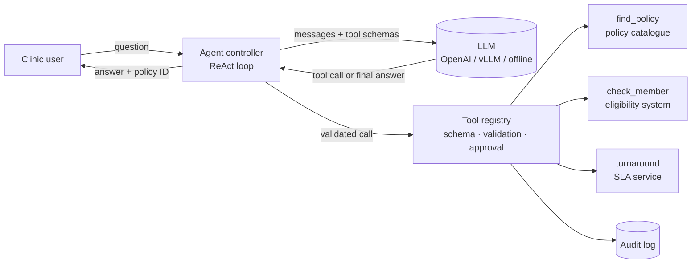
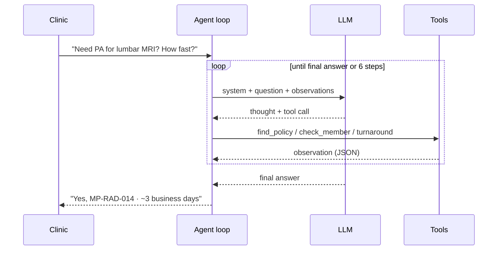

# Class 1 — Introduction to Agentic AI

**Week 1 · Foundations**

* **Domain Example:** Clinical prior-authorization intake
* **Tools & Frameworks:** LangChain, LangGraph, OpenAI

## Learning objectives

- Tell apart an LLM call, a workflow, and an agent, and decide which one a problem needs.
- Name the five parts of every agent: model, instructions, tools, memory, and the control loop.
- Build a ReAct (reason + act) loop from scratch, then as a LangGraph state machine.
- Map the enterprise landscape: where agents create value, and what makes them risky in regulated domains.

## Key concepts

**LLM call → workflow → agent.** A single LLM call turns input into output. A *workflow* chains calls and tools along a path the developer fixes in code. An *agent* lets the model choose the next step at run time, based on what it has seen so far. More autonomy handles more varied inputs, but costs more, is harder to test, and fails in less predictable ways. Pick the lowest level that solves the problem.

**Autonomy levels.** L0: the model only suggests text. L1: a fixed workflow with LLM steps. L2: the agent picks tools, and a human approves side effects. L3: the agent acts on its own within guardrails. L4: several agents coordinate with each other. Most regulated enterprise work today stays at L1–L2.

**Anatomy of an agent.** *Model*: the reasoning engine. *Instructions*: role, goal, constraints, and output format. *Tools*: typed functions that read from or write to real systems. *Memory*: the state of the current thread plus durable knowledge. *Control loop*: observe → think → act → observe again, until the task is done or the step budget runs out.

**ReAct.** On each turn the model writes a thought, picks one action (a tool plus its arguments), and reads the observation that comes back. The loop always needs a stopping condition (a final answer, a maximum number of steps, or escalation to a human). It should also log every action to an audit trail.

**Enterprise landscape.** Common high-value patterns are knowledge assistants (RAG), document processing (claims, contracts, prior auth), operations copilots (AIOps, IT service management), and planning agents (supply chain). In healthcare and legal, the hard problems are not model quality. They are data privacy (PHI), explainability (citations), auditability, and keeping a human accountable for every decision.

## Worked example

A clinic asks: *"Does member M-2231 need prior auth for a lumbar MRI, and how fast will we hear back?"* The assistant has three tools, `find_policy`, `check_member` and `turnaround`. `example.py` solves the task twice, first as a fixed workflow and then as a ReAct agent that chooses its own calls. `langgraph_version.py` rebuilds the same agent as an explicit graph.

## Architecture



## Process flow



## Run it

```bash
python -m classes.class01_intro_agentic_ai.example
python -m classes.class01_intro_agentic_ai.langgraph_version   # prints the graph as Mermaid too
```

With no `OPENAI_API_KEY`, an offline planner stands in for the model, so the loop still runs deterministically. Set a key and the same code sends real tool-calling requests.

## Lab

1. Ask about `office visit` instead. Does the agent skip the turnaround call? Change the planner or the prompt so it does.
2. Pass an unknown member ID. Watch how the registry returns a structured error that the model can recover from.
3. Add a step budget of 2 and handle the "escalate to a human" path in the UI.
4. Write one paragraph on why this task needs L2 autonomy rather than L3.

## Key takeaways

- Start with a workflow; move to an agent only when the steps can't be known in advance.
- Tools and the loop are ordinary software. Validate, log, and bound them.
- A graph (LangGraph) makes the agent's control flow visible, testable and resumable.
