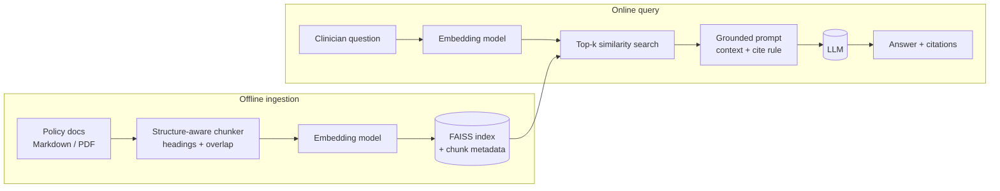
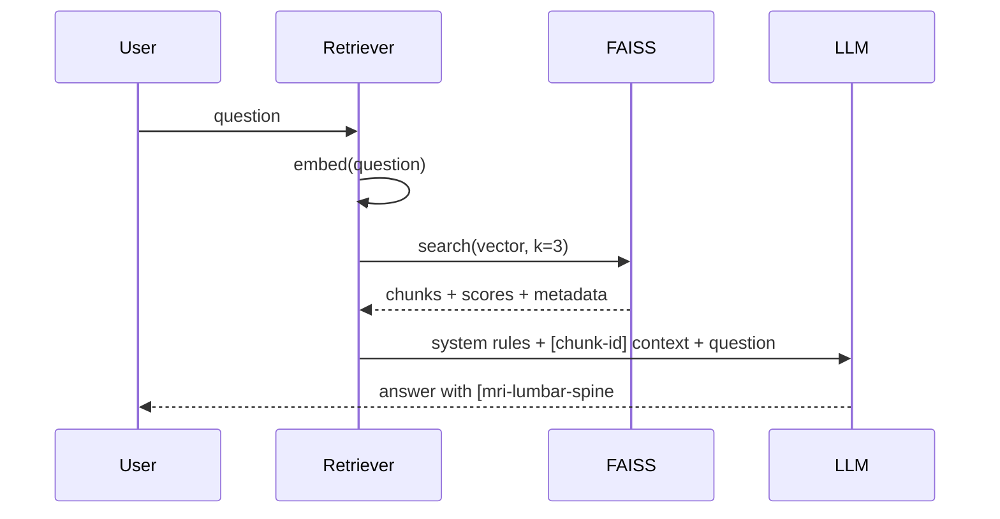

# Class 3 — Embeddings and RAG

**Week 2 · Retrieval**

* **Domain Example:** Clinical medical-policy Q&A
* **Tools & Frameworks:** FAISS, OpenAI embeddings

## Learning objectives

- Explain what an embedding is and why cosine similarity finds related text.
- Build a RAG pipeline end to end: ingest, chunk, embed, index, retrieve, then generate a grounded answer.
- Chunk by document structure, and keep the metadata needed for citations.
- Write a grounding prompt that forces citations and allows "not found".
- Measure retrieval with hit@k before tuning anything else.

## Key concepts

**Embeddings.** A model maps text to a vector (for example 1,536 floats) so that texts with similar meaning point in similar directions. Similarity is the cosine of the angle between two vectors; after L2 normalisation, that is just a dot product. Semantic models match paraphrases ("heart attack" ≈ "myocardial infarction"). Lexical methods match only shared words. `embeddings_demo.py` shows the difference.

**Why RAG?** Models don't know your private or recent documents, and when they guess, they hallucinate. Retrieval-augmented generation fetches the relevant passages at question time and tells the model to answer only from them. You get fresher answers, a smaller hallucination surface, and citations an auditor can check.

**Chunking.** Chunks that are too big dilute similarity and waste context. Chunks that are too small lose meaning. Split on headings first, then pack paragraphs up to roughly 500–1,000 characters with a small overlap. Store `doc_id`, `section`, and the policy front matter (policy ID, specialty, effective date) on every chunk.

**Vector index.** FAISS `IndexFlatIP` does exact search, which is fine for up to about 100k vectors. Beyond that, use approximate indexes such as IVF or HNSW, or a managed vector database.

**Grounded generation.** The prompt contains numbered context blocks, an instruction to cite `[chunk-id]` on every sentence, and a way out ("Not found in policy documents"). In clinical settings, also say plainly that the answer is policy information and not medical advice.

**Retrieval metrics first.** If the right chunk never reaches the prompt, no prompt can fix the answer. Track hit@k (is any relevant chunk in the top k?) on a small golden set from day one.

## Worked example

Four synthetic payer medical policies: lumbar MRI, GLP-1 agonists, knee arthroscopy, and home sleep testing. `example.py` indexes them into FAISS, answers questions with citations, and reports hit@3 on a 10-question golden set.

## Architecture



## Process flow



## Run it

```bash
python -m classes.class03_embeddings_rag.embeddings_demo
python -m classes.class03_embeddings_rag.example
python -m classes.class03_embeddings_rag.example "What STOP-BANG score supports home sleep testing?"
```

## Lab

1. Look at the sources for the first sample question: offline retrieval ranks the *knee* policy chunk first, because both policies say "conservative therapy". The answer is still right only because the offline answerer prefers chunks whose title matches the question. Explain why ranking matters anyway. (Class 4 fixes this with hybrid search and metadata filters.)
2. Change `max_chars` to 300 and then 1,500. How do hit@3 and answer quality change?
3. Ask something that isn't covered ("Is acupuncture covered?"). Does the pipeline say "not found"?
4. Online: compare the offline hashing embedder with `text-embedding-3-small` using `embeddings_demo.py`.

## Key takeaways

- RAG quality is capped by retrieval quality, so measure hit@k first.
- Chunk by structure and keep metadata; citations depend on it.
- The grounding prompt must allow "I don't know".
