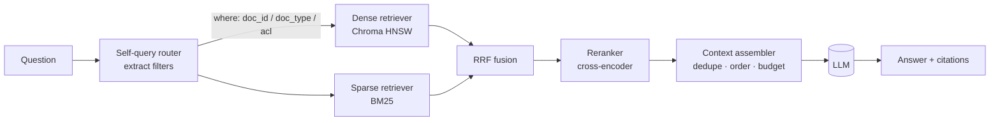
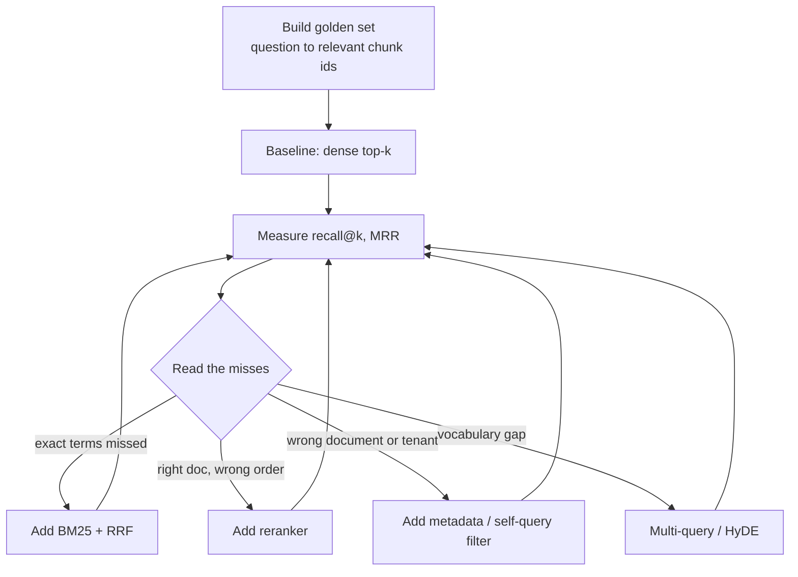

# Class 4 — RAG Design

**Week 2 · Retrieval**

* **Domain Example:** Legal contract and playbook search
* **Tools & Frameworks:** Chroma DB, FAISS, BM25

## Learning objectives

- Choose chunking, indexing, and retrieval strategies based on measurements, not defaults.
- Combine dense and sparse retrieval with Reciprocal Rank Fusion (RRF), then rerank.
- Use metadata filters and self-query routing to scope a search to one contract, a tenant, or an access-control group.
- Evaluate retrieval with recall@k and MRR, and read the misses.
- Know the advanced patterns: multi-query, HyDE, parent-document, and contextual compression.

## Key concepts

**Dense vs sparse.** Dense vectors catch paraphrases but blur exact terms such as party names, clause numbers, and ICD codes. BM25 nails exact terms but misses synonyms. Legal and clinical text is full of exact terms, so you usually want both.

**Hybrid with RRF.** Merge ranked lists with `score = Σ 1/(k + rank)`, typically with k = 60. This needs no score calibration between retrievers and is hard to beat.

**Reranking.** Retrieve a wide set (for example 20), then reorder it with a cross-encoder that reads the query and the chunk together (bge-reranker, Cohere Rerank). This is usually the cheapest large gain in precision. `rerank_overlap` in `common/retrieval.py` is a transparent stand-in.

**Metadata and self-query.** Store fields such as `doc_id`, `doc_type`, `counterparty`, `effective_date`, and `acl_group`. A self-query step turns "What cap does *Acme* propose?" into `where={"doc_id": "acme-saas-msa"}`. The same mechanism enforces permissions: always filter by the caller's ACL *inside* the retriever, never after generation.

**Chunking strategies.** Fixed-size chunks are easy but break clauses apart. Structure-aware chunks (by heading or numbered section) suit contracts and policies. Parent-document retrieval matches small chunks but returns their larger parent section. Semantic chunking splits where the embedding similarity drops.

**Query transformation.** *Multi-query*: generate 3–5 rephrasings and fuse the results. *HyDE*: embed a hypothetical answer instead of the question. *Decomposition*: split multi-part questions into several searches. Use these when the golden-set misses show a vocabulary gap.

**Context assembly.** Deduplicate, order by relevance (models attend most to the start and end of the context), label each chunk with its source, and stay within a token budget.

**Vector store choice.** Chroma is simple and embeddable, good for prototypes and small services. FAISS is an in-process library with the fastest raw search. For production, look at pgvector, Azure AI Search, Qdrant, or Weaviate, and choose on filtering, hybrid support, ACLs, and operations.

## Worked example

`example.py` indexes three synthetic contracts plus our playbook in Chroma (dense) and BM25. It then scores five configurations on 12 golden questions. Offline results:

| Configuration | recall@3 | MRR |
|---|---|---|
| 1 dense (Chroma) | 0.83 | 0.62 |
| 2 sparse (BM25) | 1.00 | 0.69 |
| 3 hybrid RRF | 0.92 | 0.65 |
| 4 hybrid + rerank | 1.00 | 0.72 |
| 5 + self-query filter | 1.00 | 0.92 |

The dense retriever confuses Acme's liability cap with Globex's, because the two sections share the same vocabulary. The metadata filter removes that ambiguity entirely.

## Architecture



## Process flow



## Run it

```bash
python -m classes.class04_rag_design.example
```

## Lab

1. Add `counterparty` metadata and make the self-query router use it instead of a hard-coded map.
2. Implement multi-query: write three rephrasings by hand (or with the LLM), fuse them with RRF, and re-measure.
3. Swap `rerank_overlap` for a real cross-encoder (`pip install sentence-transformers`, `BAAI/bge-reranker-base`).
4. Add an `acl_group` field and prove that a user without "legal-privileged" access can never retrieve the playbook.

## Key takeaways

- Every retrieval change should move a number on your golden set.
- Hybrid + rerank + metadata filters is the enterprise default.
- Apply access control in the retriever, never in the prompt.
