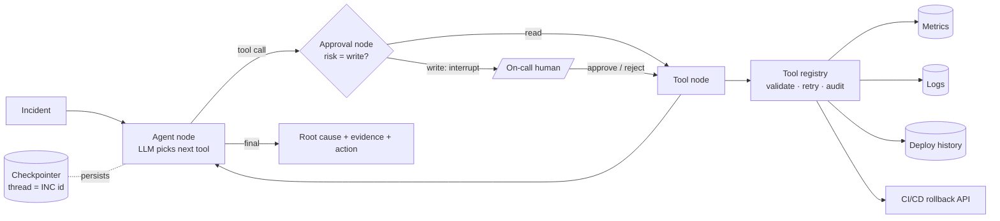
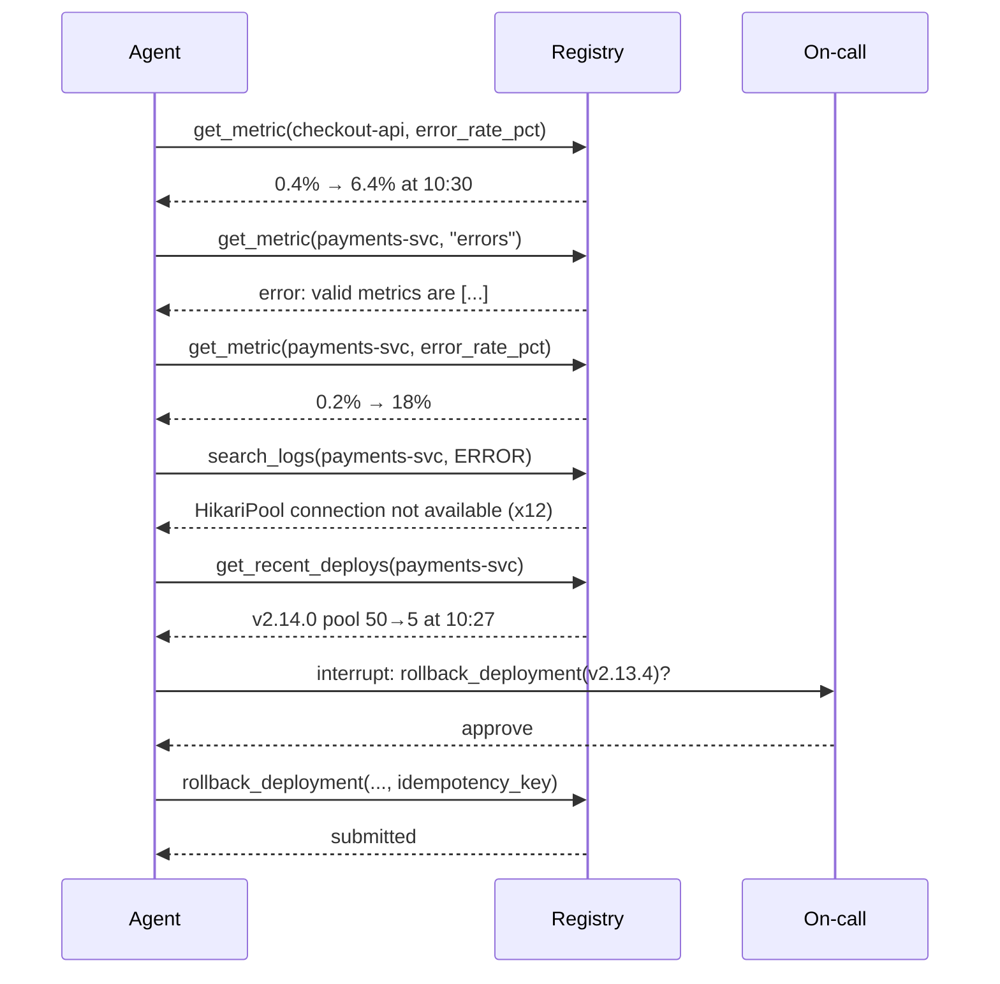

# Class 5 — Tool Engineering

**Week 3 · Tools & Memory**

* **Domain Example:** AIOps incident investigation
* **Tools & Frameworks:** OpenAI function calling, LangGraph (ToolNode pattern, interrupts)

## Learning objectives

- Design tools that models use correctly: clear names, typed arguments, useful descriptions, compact outputs.
- Build a tool layer with validation, retries, structured errors, audit logs, and risk levels.
- Gate side-effecting tools behind human approval with a LangGraph `interrupt`, then resume from a checkpoint.
- Make write tools idempotent, and understand why they must be.
- Recognise tool anti-patterns ("run anything", huge outputs, overlapping tools).

## Key concepts

**Tools are the agent's API.** The model only sees a name, a description, and a JSON schema. Poor names or vague descriptions cause wrong calls far more often than a weak model does. Write descriptions that say *when* to use the tool, what it returns, and in what units.

**Seven rules** (applied in `ops_tools.py`):
1. One job per tool, named verb_noun.
2. Typed, constrained arguments (enums, ranges), so the schema *is* the documentation.
3. Descriptions state when to use the tool.
4. Small, pre-summarised outputs (baseline, current value, change point), never raw dumps.
5. Actionable errors ("valid metrics are …") so the model can correct itself.
6. A risk level on every tool, with approval for writes.
7. Idempotency keys on writes.

**Tool selection at scale.** Beyond about 15–20 tools, accuracy drops. Group tools into toolsets per sub-agent, or retrieve the relevant tools by embedding similarity before each turn.

**Error handling.** Validate arguments *before* running the tool (pydantic). Retry transient failures with backoff, and return failures to the model as text rather than raising. Cap the loop with a step budget.

**Human in the loop.** LangGraph's `interrupt()` pauses the graph and saves its state in a checkpointer. A human approves or rejects, and `Command(resume=...)` continues from exactly the same point, even in another process or days later.

**Security.** Least privilege (read-only credentials for read tools), per-tool rate limits, allow-lists for arguments, and never letting model output flow directly into shell or SQL commands.

## Worked example

Incident INC-4471: checkout-api 5xx errors are up. The agent:
1. Checks checkout's error rate.
2. Asks for a metric that doesn't exist and gets back an error listing the valid names.
3. Retries with the right metric and sees payments-svc 5xx jump from 0.2% to 18%.
4. Finds HikariPool "connection not available" errors in the logs.
5. Sees that deploy v2.14.0 cut the database pool from 50 to 5.
6. Proposes a rollback. The graph pauses for approval, then resumes.

## Architecture



## Process flow



## Run it

```bash
python -m classes.class05_tool_engineering.example            # you approve at the prompt
python -m classes.class05_tool_engineering.example --approve  # auto-approve
```

## Lab

1. Reject the rollback with a reason. Make the agent propose a safer mitigation (scale out) instead.
2. Call `rollback_deployment` twice with the same idempotency key and confirm the second call is a no-op.
3. Add a `get_dependency_graph` tool and have the agent confirm that checkout's errors are downstream of payments.
4. Replace the registry with LangGraph's prebuilt `ToolNode` plus `ChatOpenAI.bind_tools`, and compare.

## Key takeaways

- Most tool-calling failures come from tool design, not from the model.
- Validation errors fed back to the model are self-healing.
- Anything that changes production goes through an interrupt, an audit entry, and an idempotency key.
