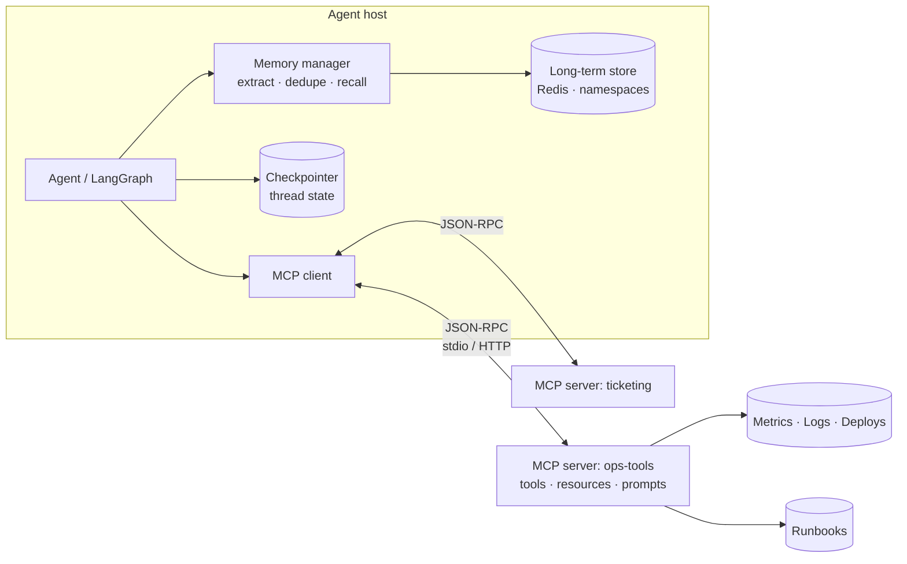
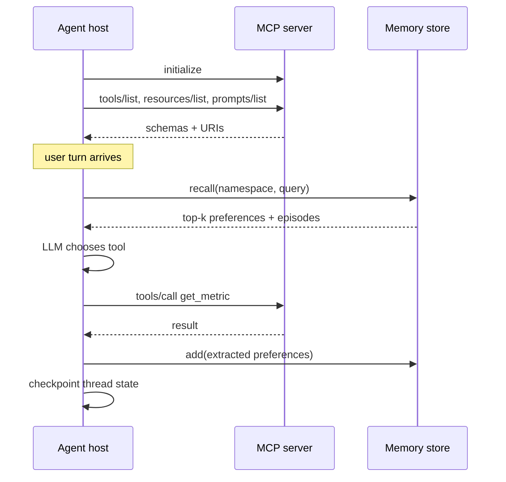

# Class 6 — Memory in Agents and the Model Context Protocol

**Week 3 · Tools & Memory**

* **Domain Example:** AIOps tool server; clinical documentation assistant
* **Tools & Frameworks:** MCP (Python SDK / FastMCP), LangGraph checkpointer, LangMem, Redis

## Learning objectives

- Distinguish short-term (thread) memory, episodic memory, and semantic memory, and choose a store for each.
- Implement the memory write path (extract, deduplicate, store) and read path (recall by relevance, recency, and importance).
- Isolate memory by namespace (user, patient, tenant) and support "forget me".
- Expose tools, resources, and prompts through an MCP server, and consume them from an MCP client.
- Decide what should be an MCP server and what should stay in-process.

## Key concepts: memory

**Short-term memory** is the state of one conversation or task. In LangGraph it is the graph state, saved after every step by a *checkpointer* keyed by `thread_id`. Use `MemorySaver` in development and Redis or Postgres checkpointers in production. This is what lets an interrupted incident or prior-auth review resume later.

**Long-term memory** outlives threads:
- *Semantic*: durable facts and preferences ("Dr. Rao prefers bullets, policy ID first").
- *Episodic*: summaries of past sessions ("Reviewed PA-1001; waiting for PT dates").
- *Procedural*: learned instructions, such as prompt updates proposed from feedback.

**Write path.** Extract candidate memories, either with an LLM or with LangMem's `create_memory_manager`. Deduplicate and merge near-duplicates (the `MemoryStore` here uses a similarity above 0.92). Attach importance and a timestamp. Never store what the policy forbids (for example raw PHI in a general store).

**Read path.** Score = similarity + recency decay + importance. Keep k small, since injecting too much memory drowns the actual task.

**Isolation and governance.** Namespace every key (`prefs:{user}`, `patient:{mrn_hash}`). Enforce the namespace server-side. Provide `forget(namespace)` for data-subject requests, and set a retention period.

## Key concepts: MCP

**The problem.** Every agent framework has its own tool format, so N agents × M systems means N×M integrations. MCP is an open protocol (JSON-RPC over stdio or streamable HTTP) that turns this into N+M: a system exposes one MCP server, and any MCP-capable host can use it.

**Primitives.** *Tools* are model-invoked functions with JSON schemas. *Resources* are read-only content addressed by URI (`runbook://db-connection-pool-exhaustion`). *Prompts* are reusable templates (`incident_triage`). The host also controls *sampling* and *roots*.

**Lifecycle.** The client launches or connects to the server, calls `initialize`, then `list_tools`, `list_resources` and `list_prompts`. It passes the tool schemas to the LLM, proxies `call_tool`, and returns the results to the model.

**Security.** Expose least privilege (this server deliberately omits `rollback_deployment`). Authenticate HTTP servers with OAuth. Treat tool descriptions from third-party servers as untrusted, because they can carry prompt injection. Pin server versions.

## Worked examples

- `mcp_server.py` wraps the Class 5 read-only AIOps tools, the runbooks (as resources), and a triage prompt in a FastMCP server.
- `mcp_client.py` launches the server over stdio, discovers everything, calls two tools, reads a runbook, and renders the prompt.
- `memory_demo.py` shows a LangGraph chat with checkpointed threads plus a `MemoryStore` for preferences and episodes, with per-clinician isolation.

## Architecture



## Process flow



## Run it

```bash
python -m classes.class06_memory_mcp.mcp_client        # starts the server itself over stdio
python -m classes.class06_memory_mcp.mcp_server --http  # or serve on :8765 for other hosts
python -m classes.class06_memory_mcp.memory_demo
REDIS_URL=redis://localhost:6379 python -m classes.class06_memory_mcp.memory_demo   # durable memory
```

To add the server to an MCP host such as Claude Desktop, register the command `python -m classes.class06_memory_mcp.mcp_server` with the repository root as the working directory.

## Lab

1. Add a `list_services` tool that returns the topology, and let the client print the dependency tree.
2. Use `langchain-mcp-adapters` to load the MCP tools into the Class 5 LangGraph agent.
3. Implement `forget("prefs:dr-rao")` behind an admin-only API and write a test that proves the memories are gone.
4. Add a 90-day retention policy: memories older than the policy are skipped in `recall`.

## Key takeaways

- Checkpointed state is what makes an agent resumable; long-term memory is what makes it personal.
- Namespaces plus server-side enforcement prevent memory leaking between users or patients.
- MCP turns integrations into reusable, discoverable servers, so expose the least privilege.
