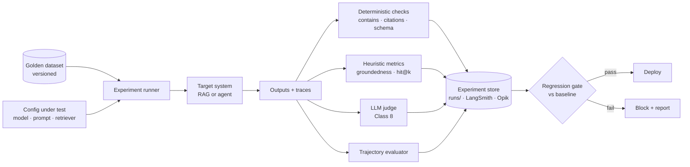
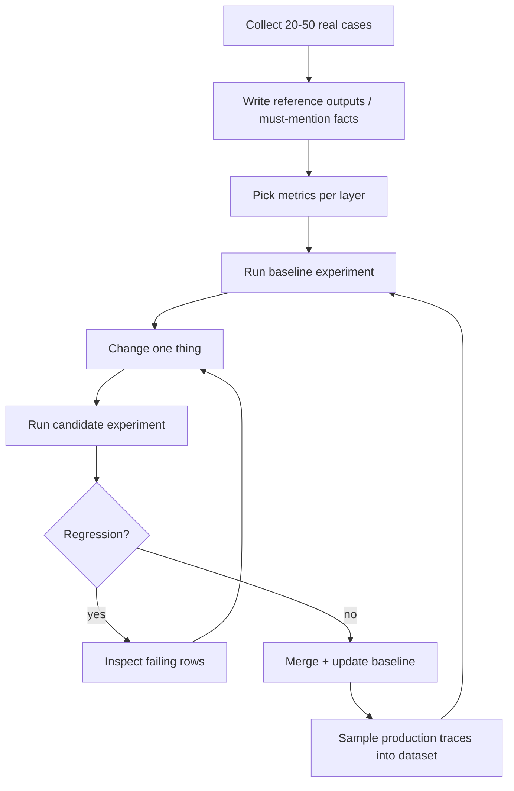

# Class 7 — Evaluating your Agent

**Week 4 · Evaluation**

* **Domain Example:** Clinical RAG assistant; AIOps agent trajectories
* **Tools & Frameworks:** LangSmith, Opik, a custom harness

## Learning objectives

- Build a golden dataset and choose metrics for each layer: retrieval, generation, tool use, and end-to-end task success.
- Run experiments, compare them, and gate releases on regressions (offline evaluation in CI).
- Evaluate agent *trajectories* (which tools, in what order, at what cost), not just final answers.
- Know when to use deterministic checks, heuristic metrics, LLM-as-judge (Class 8), or human review.
- Run the same evaluation on LangSmith or Opik for hosted datasets and experiment comparison.

## Key concepts

**Why evals.** Agent behaviour shifts with every prompt, model, or tool change. Without an evaluation set you are shipping on vibes. Evals are the unit tests of AI systems.

**The eval stack.**

| Layer | Question | Example metrics |
|---|---|---|
| Retrieval | Did we fetch the right evidence? | hit@k, recall@k, MRR |
| Generation | Is the answer correct and grounded? | exact / contains, groundedness, citation validity |
| Tool use | Right tools, right arguments, right order? | trajectory match, argument validity, forbidden-tool rate |
| Task | Did the user's job get done? | task success, escalation rate, human override rate |
| Operations | Can we afford it? | p50/p95 latency, tokens, cost per task |

**Golden datasets.** Start with 20–50 real, representative cases, including the hard ones and the ones that must be refused. Grow the set from production failures (Class 8). Version it like code.

**Offline vs online evaluation.** *Offline*: fixed dataset, run before release, gate in CI. *Online*: score live traffic (sampled judges, user feedback, business KPIs), and watch for drift.

**Experiment discipline.** Change one thing at a time, compare against a baseline, set a tolerance, and fail the build on regressions. Record the model, prompt version, and retriever configuration with each run.

**Trajectory evaluation.** For agents, check that required tools were called in order, that no forbidden or write tools were called without need, and step efficiency (expected steps ÷ actual steps). A correct answer reached through an unsafe path is still a failure.

**LangSmith and Opik.** Both offer hosted datasets, experiments linked to traces, side-by-side comparison, annotation queues, and online evaluators. The concepts map one to one onto `eval_harness.py`: Dataset, Target, Evaluators, Experiment, Compare.

## Worked example

Part 1 compares two configurations of the clinical RAG assistant on 10 golden questions:

| Metric | baseline dense k=1 | hybrid + rerank k=3 |
|---|---|---|
| retrieval_hit | 0.9 | 1.0 |
| correct | 0.6 | 0.9 |
| citations_valid | 1.0 | 1.0 |
| grounded | 1.0 | 1.0 |

The regression gate passes. One remaining wrong answer (HbA1c threshold) goes to Class 8's error analysis.

Part 2 evaluates the Class 5 AIOps agent's trajectory. It used the required tools in order and found the root cause. Step efficiency is only 0.5 because of the recovered bad call and the extra metric checks, and that is exactly the kind of cost you want to see.

## Architecture



## Process flow



## Run it

```bash
python -m classes.class07_evaluation.example
python -m classes.class07_evaluation.vendor_integrations langsmith   # needs LANGSMITH_API_KEY
python -m classes.class07_evaluation.vendor_integrations opik        # needs OPIK_API_KEY
```

## Lab

1. Add three "should refuse" questions (for example dosing advice) with a `refused` evaluator.
2. Wire `compare()` into a pytest test so CI fails on regressions.
3. Add token cost per question using `LLM.usage` and report cost per correct answer.
4. Add a second incident to the trajectory dataset (the batch-worker disk alert) with its own expected tools.

## Key takeaways

- Evaluate every layer; retrieval failures pretend to be generation failures.
- For agents, the path matters as much as the answer.
- A regression gate turns evals from a report into a release control.
