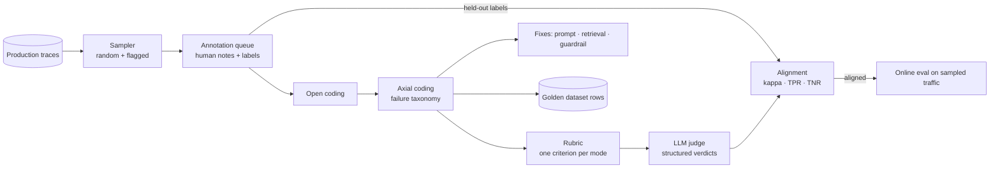
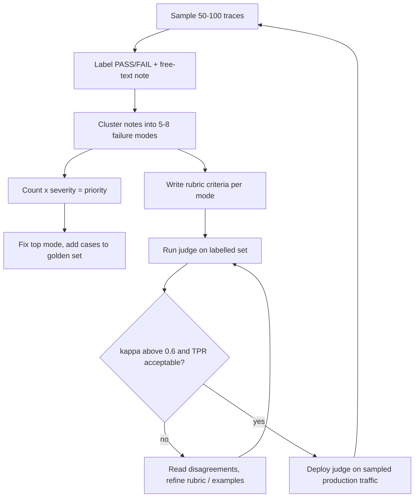

# Class 8 — Error Analysis and LLM as Judge

**Week 4 · Evaluation**

* **Domain Example:** Legal contract Q&A
* **Tools & Frameworks:** LangSmith / Opik annotation queues, OpenAI (judge model)

## Learning objectives

- Run a structured error analysis: sample traces, open-code them, group codes into a taxonomy, then prioritise.
- Turn a failure taxonomy into a rubric-based LLM judge with structured, per-criterion verdicts.
- Align a judge with human labels: accuracy, Cohen's kappa, TPR and TNR, and read every disagreement.
- Recognise judge biases (position, verbosity, self-preference, leniency) and how to mitigate them.
- Close the loop: failures become dataset rows, rubric criteria, and guardrails.

## Key concepts

**Error analysis comes before metrics.** Generic metrics such as "helpfulness" rarely match what actually breaks. Read 30–100 real traces first. For each failure, write a short free-text note (*open coding*). Then cluster the notes into 5–8 failure modes (*axial coding*). Count them, weight by severity, and fix the top of the list.

**A typical legal and clinical RAG taxonomy.** Wrong document (cross-contract confusion), hallucinated value, missing or invalid citation, incomplete answer, contradiction of the source (for example reversed parties), and policy violation (giving advice or guarantees).

**LLM as judge.** A second model grades outputs against a rubric. It scales human judgement for nuanced criteria that string checks can't capture (completeness, contradiction). Design rules:
- Use binary PASS/FAIL per criterion, not 1–10 scales.
- Show the judge exactly what the system saw: question, context, and answer.
- Ask for the rationale before the verdict, use structured output, and set temperature to 0.
- Keep one criterion per concern, so failures are diagnosable.
- Use a strong model as judge, and preferably a different model family from the system being judged.

**Alignment with humans.** Hold out 50–100 human-labelled examples.
- *Accuracy* can mislead when classes are imbalanced.
- *Cohen's kappa* measures agreement beyond chance: above 0.6 is substantial, above 0.8 near-perfect.
- *TPR* (the judge catches real failures) matters most for safety.
- *TNR* (the judge doesn't flag good answers) controls noise.

Iterate on the rubric until the disagreements you read are acceptable.

**Biases.** *Position*: in pairwise comparisons, swap A and B and average. *Verbosity*: longer answers get favoured, so penalise unsupported length. *Self-preference*: models favour their own family's outputs. *Leniency*: calibrate with borderline examples in the rubric.

**Where deterministic checks win.** Citations that point at retrieved ids, numbers present in the cited text, schema validity, and PII leaks should all be code, not judgement. Use the judge only for what code can't check.

## Worked example

`samples.json` holds 16 labelled answers from a contract Q&A assistant, each with a human verdict and note.
1. Error analysis codes the 7 failures into a taxonomy. Policy violations and contradictions come out as the top priorities.
2. `judge.py` applies a five-criterion rubric (grounded, correct_doc, cited, complete, policy). Online, it calls the LLM. Offline, it uses transparent checks: citations present and retrieved, numbers found in the cited text, the counterparty matching the cited contract, and policy phrases.
3. Alignment offline: 88% accuracy, κ = 0.74, TPR 71%, TNR 100%. The two misses are an *incomplete* answer and *reversed parties*. Those need semantic judgement, which is exactly where an LLM judge earns its cost.

## Architecture



## Process flow



## Run it

```bash
python -m classes.class08_error_analysis_judge.example
OPENAI_API_KEY=... python -m classes.class08_error_analysis_judge.example   # real LLM judge
```

## Lab

1. Online: does the LLM judge catch s08 (incomplete) and s15 (reversed parties)? Recompute κ.
2. Add a pairwise judge (A vs B) and measure position bias by swapping the order.
3. Add an offline "contradiction" check for indemnity direction (who indemnifies whom) and see whether TPR rises.
4. Label 10 new answers from the Class 7 candidate run and add them to the alignment set.

## Key takeaways

- Read traces before choosing metrics; your taxonomy is your roadmap.
- A judge is a model too: validate it against humans before trusting it.
- Put checkable rules in code and leave judgement to the judge.
