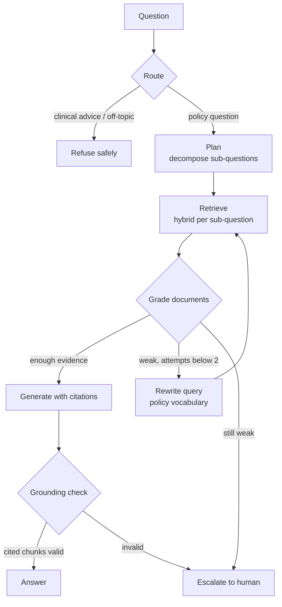
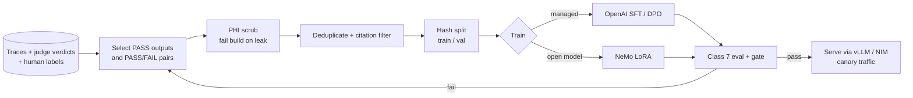

# Class 9 — Agentic RAG and Fine-tuning

**Week 5 · Advanced retrieval & performance**

* **Domain Example:** Clinical policy assistant
* **Tools & Frameworks:** LangGraph, NVIDIA NeMo, OpenAI fine-tuning

## Learning objectives

- Turn single-shot RAG into an agentic loop: route, plan, retrieve, grade, rewrite, generate, and verify.
- Implement Corrective and Self-RAG patterns: document grading, query rewriting, and grounding checks with escalation.
- Decompose multi-part questions and answer each part with its own evidence.
- Decide between prompting, RAG, and fine-tuning, and when to combine them.
- Build SFT and DPO datasets from your own traces and labels with PHI scrubbing, deduplication, and leakage-free splits.
- Run a LoRA fine-tune (NeMo) or a managed fine-tune (OpenAI), and evaluate it before switching traffic.

## Key concepts: agentic RAG

**Why.** Plain RAG retrieves once. When the query uses a brand name ("Ozempic") or slang ("A1c"), or asks two things at once, one retrieval pass returns weak evidence and the model improvises. Agentic RAG makes retrieval a decision the system can revisit.

**The pattern (see `agentic_rag.py`).**
- *Route*: in-scope policy question, or refuse (dosing or clinical advice)?
- *Plan*: decompose "Compare X for A and B" into sub-questions.
- *Retrieve*: hybrid search for each sub-question.
- *Grade*: keep only the chunks that are actually relevant (an LLM yes/no, or an overlap check offline).
- *Rewrite*: when the evidence is weak, translate the query into the document's vocabulary and try again (at most 2 attempts).
- *Generate*: answer from the graded chunks only, with citations.
- *Check*: citations must reference graded chunks. If not, escalate to a human rather than guess.

**Budgets.** Every loop has a maximum iteration count. Log each decision (`state.log`) so error analysis can see *why* the system retrieved what it did.

## Key concepts: fine-tuning

| Need | Best tool |
|---|---|
| New or changing knowledge (policies, contracts) | RAG |
| Output format, tone, refusal behaviour, domain style | Prompting first, then SFT |
| Preference for one kind of answer over another (grounded over fluent) | DPO / preference tuning |
| Lower latency and cost at the same quality | Distil a large model into a small fine-tuned one |

**Data comes from your system.** Use judge-PASS or human-approved traces as SFT targets, and Class 8's pass/fail pairs as DPO pairs. Scrub PHI (the build fails if any identifier survives), deduplicate by prompt, and split deterministically by hash.

**LoRA.** Train small low-rank adapters (0.1–1% of the weights) instead of the full model. That means cheaper training, adapters you can swap per domain, and serving many LoRAs on one base model in vLLM.

**Evaluate before switching.** A fine-tuned model is just another experiment in Class 7. Run the same golden set and regression gate, and watch for lost general ability.

## Worked example

`agentic_rag.py` offline:
- *"What a1c is needed before starting ozempic?"* The first retrieval is graded 0 of 3 relevant. The query is rewritten to "HbA1c … semaglutide", and the retry finds the GLP-1 criteria (HbA1c ≥ 7.0%).
- *"Compare the conservative therapy requirement for lumbar MRI and knee arthroscopy."* This is decomposed into two sub-questions, and each answer cites its own policy.
- *"What dose of semaglutide should I take?"* This is routed to a refusal.

`finetune_data.py` writes 10 SFT training rows, 1 validation row, and 7 DPO pairs. `launch_finetune.py` starts an OpenAI job or prints the NeMo LoRA recipe.

## Architecture



## Process flow: fine-tuning pipeline



## Run it

```bash
python -m classes.class09_agentic_rag_finetuning.agentic_rag
python -m classes.class09_agentic_rag_finetuning.finetune_data
python -m classes.class09_agentic_rag_finetuning.launch_finetune nemo     # prints the LoRA recipe
python -m classes.class09_agentic_rag_finetuning.launch_finetune openai   # needs OPENAI_API_KEY
```

## Lab

1. Add a "needs patient data" route that calls a (mock) EHR tool before retrieval.
2. Make the grader a real LLM call and compare its keep rate with the overlap heuristic.
3. Add HyDE as a third rewrite strategy and measure retries saved on a paraphrased golden set.
4. Extend `finetune_data.py` to export NeMo's input/output format, and validate that no MRN or phone number survives.

## Key takeaways

- Agentic RAG spends extra calls only when the evidence is weak; grade before you generate.
- Escalating is a feature: "I'm not sure" beats a confident hallucination in clinical and legal work.
- Fine-tune for behaviour, not knowledge, and prove it with the same evals.
