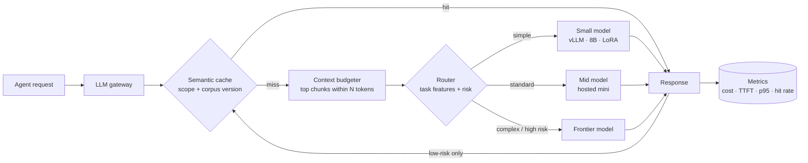
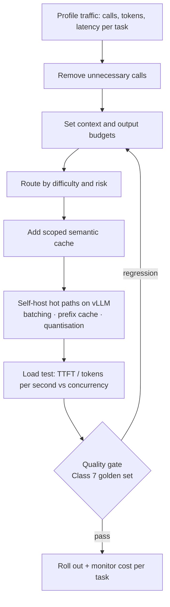

# Class 10 — Inference Optimization

**Week 5 · Advanced retrieval & performance**

* **Domain Example:** Mixed clinical, legal and AIOps traffic
* **Tools & Frameworks:** vLLM, NVIDIA NeMo / NIM, OpenAI-compatible APIs

## Learning objectives

- Break agent cost and latency into their drivers: calls per task, prompt tokens, output tokens, model tier, and queueing.
- Apply the optimisation ladder: fewer calls, smaller prompts, cheaper models, caching, and efficient serving.
- Build a model router and a scoped, versioned semantic cache that are safe for regulated data.
- Serve open models with vLLM (continuous batching, prefix caching, quantisation, multi-LoRA) and load-test them.
- Read TTFT, latency, and throughput curves to size GPUs and set autoscaling targets.

## Key concepts

**Where the money and time go.** Cost ≈ Σ calls × (input tokens × input price + output tokens × output price). Latency ≈ queueing + time to first token (TTFT) + output tokens × time per token. Output tokens are the slow and expensive part, so ask for concise, structured outputs.

**The optimisation ladder** (cheapest wins first):
1. *Fewer calls.* Use deterministic code where rules suffice, and merge steps.
2. *Smaller prompts.* Keep a retrieval context budget, trim history, and use short system prompts.
3. *Cheaper models.* Route easy tasks (classification, extraction) to small models and keep the frontier model for reasoning and high-risk decisions.
4. *Caching.* Use prefix caching on the server, exact caches, and semantic caches for FAQ-style questions.
5. *Serving efficiency.* Use continuous batching, quantisation (AWQ/GPTQ/FP8), speculative decoding, and tensor parallelism.
6. *Fine-tuning or distillation (Class 9).* A small tuned model can replace a large prompted one.

**Semantic cache safety.** Scope every key by tenant and corpus version, set a TTL, and never cache patient-specific answers or high-risk decisions. Invalidate the cache when a policy document changes.

**vLLM.** An open-source inference server with PagedAttention (efficient KV-cache memory), continuous batching (new requests join running batches), prefix caching (shared system prompts are computed once), and multi-LoRA serving. It exposes an OpenAI-compatible API, so `LLM_BASE_URL` is the only change your agents need. NVIDIA NIM packages optimised engines (TensorRT-LLM) behind the same API style.

**Measuring.** Track TTFT (perceived responsiveness), end-to-end p50/p95, and aggregate tokens per second at rising concurrency. Scale out when TTFT p95 breaches your SLO, not when GPU utilisation looks high.

**Quality guardrail.** Every optimisation is an experiment. Rerun the Class 7 golden set: routing, trimming, or quantising can quietly cost accuracy.

## Worked example

`example.py` replays 60 production-like requests through the same cost model, adding one strategy at a time:

| Strategy | $ / 1k requests | Saving | p50 ms |
|---|---|---|---|
| A all-large | 7.46 | 0% | 2100 |
| B + routing | 4.76 | 36% | 970 |
| C + semantic cache | 4.44 | 41% | 15 |
| D + context budget 1.5k | 2.06 | 72% | 15 |

p95 stays high because high-risk root-cause and denial tasks deliberately keep the large model and bypass the cache. `benchmark.py` load-tests a real endpoint (for example the vLLM server from `docker-compose.vllm.yml`) at concurrency 1, 4 and 16.

## Architecture



## Process flow



## Run it

```bash
python -m classes.class10_inference_optimization.example
# GPU host:
docker compose -f classes/class10_inference_optimization/docker-compose.vllm.yml up -d
LLM_BASE_URL=http://localhost:8000/v1 OPENAI_API_KEY=dummy LLM_MODEL=meta-llama/Llama-3.1-8B-Instruct \
  python -m classes.class10_inference_optimization.benchmark
```

## Lab

1. Move "Compare … explain the risk" from the large tier to the medium tier and measure the quality impact with Class 7.
2. Add a corpus-version bump halfway through the workload and confirm the cache invalidates.
3. Benchmark vLLM with and without `--enable-prefix-caching` using a long shared system prompt.
4. Add token-streaming to the clinical Q&A API, and measure perceived latency (TTFT) against total latency.

## Key takeaways

- Most savings come from calling less and routing well, before you touch GPUs.
- Cache only what is safe to reuse, and scope and version every entry.
- Optimisations must pass the same quality gate as features.
