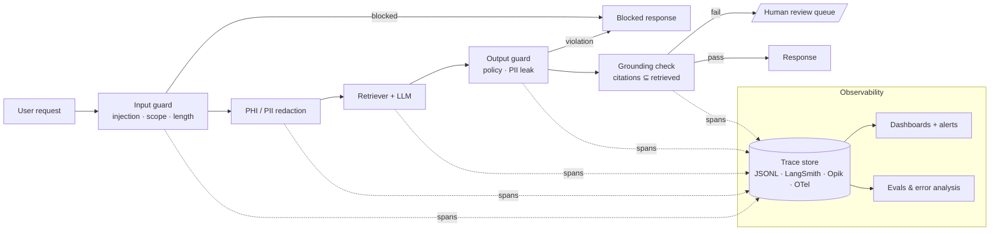
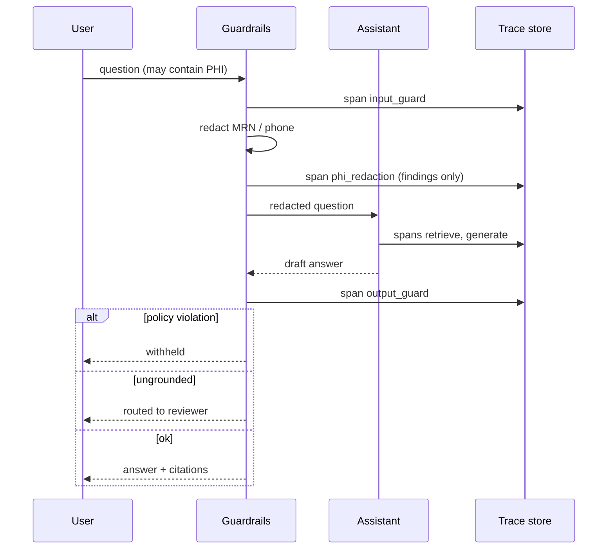

# Class 11 — Observability and Guardrails

**Week 6 · Production**

* **Domain Example:** Clinical assistant with PHI
* **Tools & Frameworks:** LangSmith / Opik tracing, OpenTelemetry, NeMo Guardrails / Azure AI Content Safety (optional layers)

## Learning objectives

- Instrument an agent so every request becomes a trace of spans (guardrails, retrieval, LLM, tools) with latency, inputs, outputs, and metadata.
- Build layered guardrails: input screening, PHI/PII redaction, output policy, grounding checks, and human-review routing.
- Choose what to log in regulated domains (metadata, not raw PHI) and how long to keep it.
- Turn traces into operational metrics: latency per stage, block and review rates, error rates, and cost.
- Connect traces to evals (Class 7) and error analysis (Class 8) to close the quality loop.

## Key concepts: observability

**Traces and spans.** A trace is one request. Spans are its steps, arranged as a tree with a parent id, timing, inputs, outputs, and attributes. For agents, span kinds are `chain`, `llm`, `retriever`, `tool`, and `guardrail`. `common/tracing.py` writes JSONL locally and forwards to LangSmith or Opik when a key is set. `otel_setup.py` shows the vendor-neutral OpenTelemetry route with GenAI semantic conventions.

**What to record.** The model and prompt version, token usage, retrieved chunk ids, tool arguments and results (summarised), guardrail findings, the final status, and user feedback. In healthcare, log *metadata about* PHI (for example `redacted: MRNx1`), never the PHI itself. Apply retention limits and role-based access to traces.

**Dashboards and alerts.** p50/p95 latency by stage, error rate, guardrail block and review rate, escalation rate, cost per task, and online judge scores. Alert on sudden shifts, which usually mean a model, prompt, or data change.

## Key concepts: guardrails

| Layer | Examples | Action |
|---|---|---|
| Input | Prompt-injection patterns, length limits, topic scope | Block or reframe |
| Data | PHI/PII redaction before the LLM; ACL-filtered retrieval | Redact |
| Output | Clinical/legal policy phrases, PII leakage, toxicity | Block |
| Grounding | Citations must reference retrieved chunks; numbers in the source | Human review |
| Action | Risk-tiered tools, approval interrupts, rate limits | Approve / deny |

Keep deterministic, auditable rules as the base layer. Add model-based classifiers (NeMo Guardrails rails, Llama Guard, Azure AI Content Safety, Presidio for PII) where rules can't reach, and evaluate those classifiers like any other model.

**Fail closed, route to humans.** When a check fails, don't silently patch the answer. Block it, or send it to review with the reason attached.

## Worked example

`guarded_pipeline.py` runs five cases through a traced clinical assistant:

| Case | Outcome | Why |
|---|---|---|
| Normal policy question | Allowed | Grounded, cited |
| Question containing an MRN and a phone number | Allowed | PHI redacted before retrieval and the LLM |
| Prompt injection | Blocked | Input guard |
| "Stop taking metformin, increase the dose" | Blocked | Clinical output policy |
| Uncited answer | Human review | Grounding check |

`trace_report.py` then prints latency per stage, the outcome mix, and the span tree of the latest request.

## Architecture



## Process flow



## Run it

```bash
python -m classes.class11_observability_guardrails.guarded_pipeline
python -m classes.class11_observability_guardrails.trace_report
pip install opentelemetry-sdk opentelemetry-exporter-otlp && python -m classes.class11_observability_guardrails.otel_setup
LANGSMITH_API_KEY=... python -m classes.class11_observability_guardrails.guarded_pipeline   # traces to LangSmith
```

## Lab

1. Add name detection with Microsoft Presidio and compare its recall with the regex patterns.
2. Add a `feedback` span (thumbs up or down) and chart satisfaction by outcome.
3. Write an alert rule: block+review rate above 20% over 15 minutes pages the on-call.
4. Add a NeMo Guardrails topical rail that refuses dosing questions before retrieval.

## Key takeaways

- If you can't trace it, you can't debug, evaluate, or audit it.
- Guardrails are layered, and each layer has one job and a clear action.
- Log metadata about sensitive data, never the data itself.
