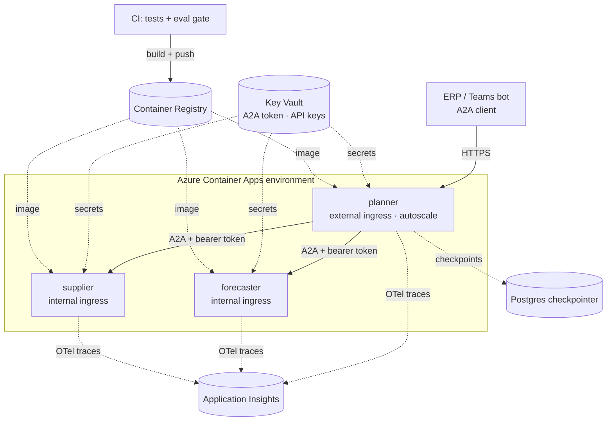
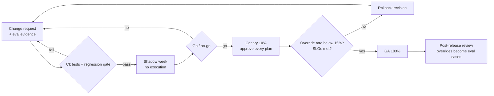

# Class 12 — Case Study: Inventory Planner · A2A Protocol · Deployment · Change Management

**Week 6 · Production**

* **Domain Example:** Hospital medical-supplies replenishment
* **Tools & Frameworks:** A2A Protocol, Docker, Azure Container Apps, LangGraph

## Learning objectives

- Design a multi-agent system whose agents belong to different teams and communicate over a standard protocol (A2A).
- Implement Agent Cards, JSON-RPC `message/send`, the task lifecycle, and `input-required` for human-in-the-loop across agent boundaries.
- Choose between orchestration patterns: a supervisor inside one graph, or peer agents over A2A. Also know how MCP and A2A fit together.
- Containerise agents, run them locally with Docker Compose, and deploy them to Azure Container Apps with secrets, internal ingress, and autoscaling.
- Plan the organisational side: shadow, canary, and GA rollout, go/no-go gates, ADKAR, and RACI.

## Key concepts

**Multi-agent patterns.**

| Pattern | When | Example in this course |
|---|---|---|
| Single agent + tools | One team, one goal | Class 5 investigator |
| Supervisor / specialists (in-process) | One team owns all agents; shared state | AIOps capstone |
| Map-reduce | The same task over many items | Legal clause review (`Send`) |
| Peer agents over A2A | Different owners, deployments, or vendors | Inventory Planner |

**MCP vs A2A.** MCP connects an agent to its *tools and data* (agent → system). A2A connects an agent to *other agents* (agent ↔ agent), which have their own reasoning, state, and long-running tasks. They are complementary: the Supplier Agent could reach the ERP through an MCP server while speaking A2A to the Planner.

**A2A essentials.**
- *Agent Card*: name, description, URL, skills, input/output modes, and auth schemes, published at `/.well-known/agent-card.json`.
- *Message*: parts of kind text, data, or file.
- *Task*: an id, a contextId, a status (`submitted`, `working`, `completed`, `failed`, `input-required`, …), and artifacts.
- Follow-ups reuse the `contextId` and `taskId`. That is how the planner asks for approval and later resumes.
- Production additions: streaming (SSE), push notifications for long tasks, OAuth2 or mTLS, and the official `a2a-sdk`.

**Deployment.** One image per agent (or one image with an agent selector). Health checks, non-root users, and secrets from a vault. Internal ingress for specialists and external ingress only for the entry agent. Autoscale on HTTP concurrency. Use a durable checkpointer (Postgres or Redis) so `input-required` tasks survive restarts and scale-out. Traces go through OpenTelemetry to Application Insights (Class 11).

**Change management.** Agents change behaviour whenever the model, prompt, tools, or data change. Treat each of these as a release: a change request with eval evidence, a shadow → canary → GA rollout, a kill switch (drop to suggest-only), and human adoption work. See `change_management.md`.

## Case study

The planning logic, agents, and deployment files are in [`projects/inventory_planner`](../../projects/inventory_planner/README.md):
- The **Forecaster** fits Holt smoothing per SKU, chosen by walk-forward backtest MAPE, and returns σ for safety stock.
- The **Supplier** returns options with price, MOQ, lead time, and on-time rate.
- The **Planner** sizes an order for *each* supplier option using that option's lead time (SS = z·σ·√(L+R)). It picks the lowest reliability-adjusted total, funds the most urgent SKUs within budget, and pauses for approval above $5,000.

## Architecture (deployed)



## Process flow (release)



## Run it

```bash
python -m projects.inventory_planner.run                 # three A2A agents + ERP client, locally
docker compose -f projects/inventory_planner/docker-compose.yml up --build
curl localhost:8103/.well-known/agent-card.json
A2A_TOKEN=... ./projects/inventory_planner/deploy/azure_container_apps.sh
```

## Lab

1. Add a fourth agent, **Budget Guardian**, owned by finance, that the planner must call before publishing POs.
2. Make the Supplier Agent reach its catalogue through an MCP server instead of a JSON file.
3. Replace `MemorySaver` with a Postgres checkpointer. Kill the planner container between `input-required` and approval, then confirm the task still resumes.
4. Write the change request for moving the approval threshold from $5k to $10k, including the go/no-go data you would need.

## Key takeaways

- Use A2A when agents have different owners; use in-process orchestration when they don't.
- `input-required` plus durable checkpoints gives you human-in-the-loop across services.
- Shipping an agent is a change-management exercise as much as a deployment.
