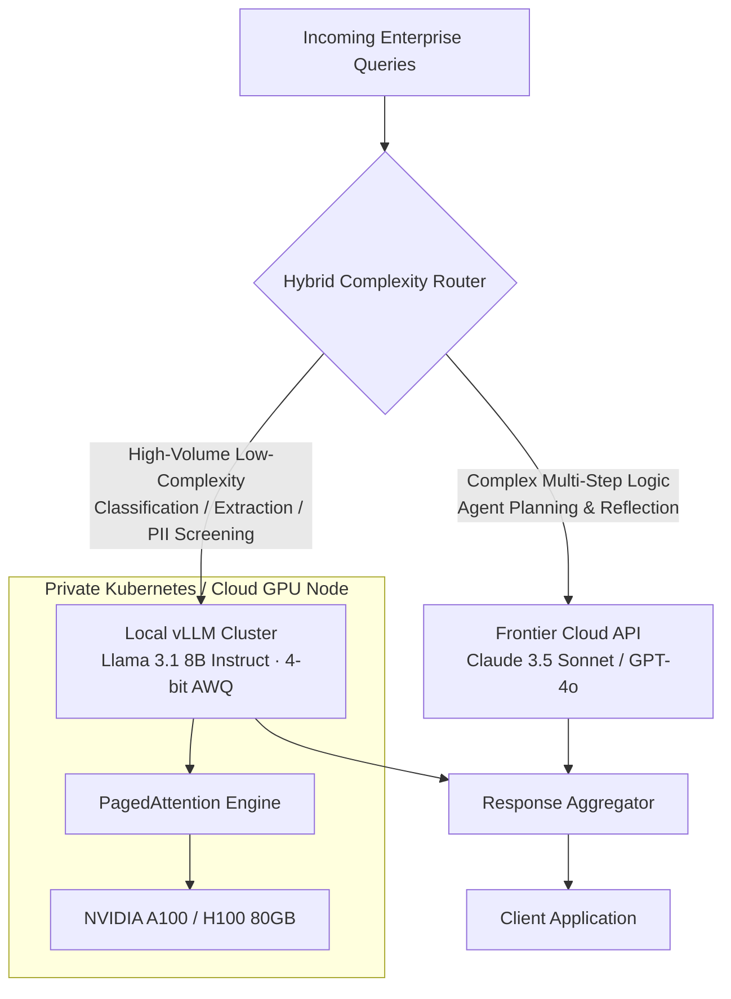

# Class 14 — Open Source vs. Proprietary Models

**Week 7 · Production & Infrastructure**

* **Domain Example:** Enterprise model hosting & TCO economics
* **Tools & Frameworks:** Llama 3, vLLM, Mistral, Ollama, OpenAI API

## Learning objectives

- Systematically evaluate the decision framework between proprietary API models (OpenAI GPT-4o, Anthropic Claude 3.5 Sonnet) and self-hosted open-weights models (Llama 3.1 70B/8B, Mistral NeMo).
- Measure Total Cost of Ownership (TCO), KV-cache GPU memory footprints, and tokens-per-dollar economics at enterprise scales.
- Implement high-throughput inference engines utilizing vLLM PagedAttention, Continuous Batching, and AWQ/GPTQ 4-bit quantization.
- Deploy hybrid routing architectures: triage simple, high-frequency requests to fast local models and escalate complex multi-step reasoning to frontier proprietary models.

## Key concepts: selection matrix

| Decision Dimension | Proprietary API (e.g. OpenAI / Claude) | Open Weights (e.g. Llama 3 on vLLM) |
|---|---|---|
| **Data Sovereignty & Privacy** | Data leaves perimeter (unless custom HIPAA BAA/zero-retention enterprise contract) | 100% On-premise / VPC isolation. Raw tokens never leave firewall |
| **Reasoning & Tool Quality** | State of the art on ambiguous, multi-step agent graphs | Excellent on domain fine-tunes; requires prompt optimization for zero-shot tool use |
| **Latency & Control** | Network transit latency; subject to provider rate limits and cold spikes | Guaranteed sub-10ms TTFT (Time To First Token) via dedicated GPU clusters |
| **Cost at Scale** | Linear pricing per million tokens ($/MTok) | Fixed capital expenditure (CapEx / GPU instances); dramatically cheaper above 10M tokens/day |
| **Fine-Tuning Freedom** | Limited to adapter layers / provider fine-tuning endpoints | Full LoRA, QLoRA, and full-weight parameter updating capabilities |

## TCO & Throughput Architecture

## Worked example

`cost_throughput_calc.py` calculates the break-even economics of hosting an internal 70B parameter model vs. cloud API consumption across varying daily token volumes.
`model_benchmarker.py` demonstrates programmatic latency and throughput benchmarking between local vLLM endpoints and remote OpenAI-compatible APIs.
