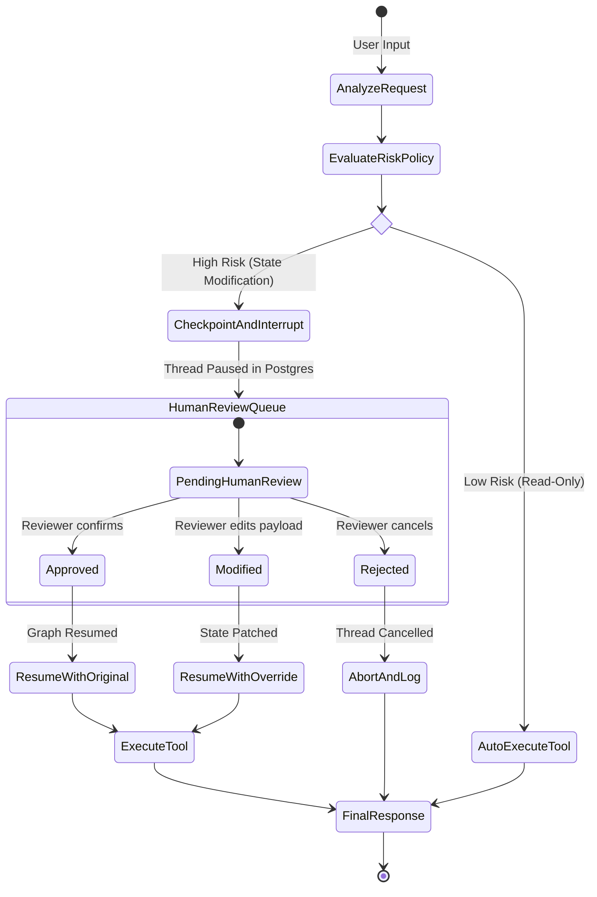

# Class 15 — Deep Dive: Human-in-the-Loop (HITL)

**Week 7 · Production & Governance**

* **Domain Example:** Regulated high-stakes decision approvals
* **Tools & Frameworks:** LangGraph Checkpointing, Interrupt & Resume, Audit Logs

## Learning objectives

- Design multi-tier Human-in-the-Loop approval workflows for agents that execute high-risk operations (financial disbursements, clinical medication orders, production server reboots).
- Master LangGraph's dynamic execution interruption (`interrupt()`) and thread checkpointing across distributed worker nodes.
- Implement time-bounded escalation paths: human review queues, timeout fallbacks, and multi-signature supervisor sign-offs.
- Build tamper-evident audit trails that log agent reasoning, human decision overrides, and state diffs for regulatory compliance.

## Key concepts: autonomy tiers & approval gates

Autonomous agents operating in regulated industries must adhere to structured autonomy governance:

| Autonomy Level | Execution Model | Human Role |
|---|---|---|
| **L1 (Assisted)** | LLM generates draft/suggestion | Human manually copies and sends |
| **L2 (Supervised Gate)** | Agent plans and stages tool call; graph execution pauses | Human clicks "Approve", "Edit", or "Reject" to resume execution |
| **L3 (Conditional Guardrails)** | Low-risk operations (< $1,000 or read-only) execute automatically; high-risk operations trigger interrupts | Human only intervenes on policy threshold exceptions |
| **L4 (Full Autonomous)** | Autonomous multi-agent coordination | Human reviews retrospective telemetry & audit trails |

## LangGraph Interrupt & Resume Architecture

## Worked example

`hitl_approval_graph.py` implements a financial agent with a LangGraph state graph. If a transaction exceeds the $2,500 enterprise policy limit, the graph automatically creates a database checkpoint, pauses execution, generates an approval token, and waits for a human reviewer to dispatch an `Approve` or `Reject` signal.
`audit_trail_manager.py` captures complete cryptographic audit signatures of all human overrides for compliance readiness.
