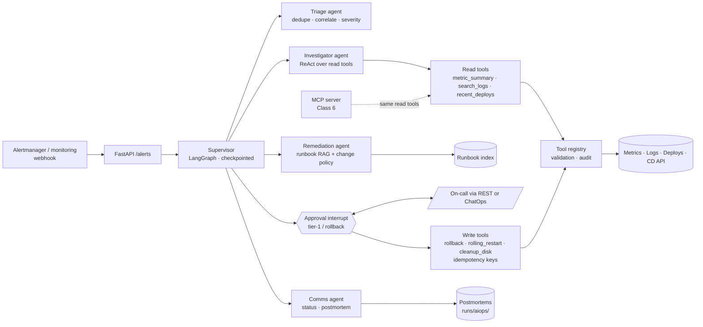
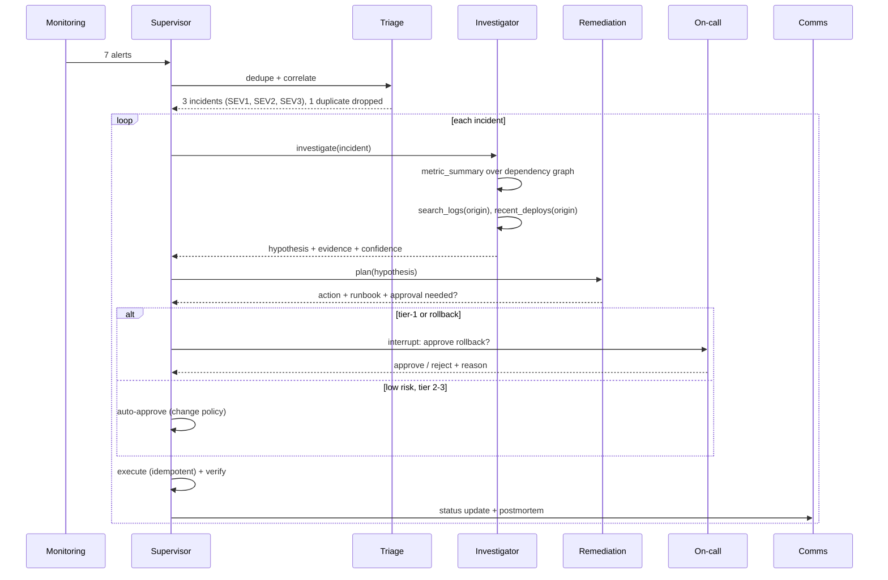

# Capstone 3 — AIOps Operations Agents

> Telemetry, services and runbooks are **synthetic**. Actions are simulated but go through a real approval and idempotency path.

An SRE team is paged by an alert storm: 7 alerts across checkout, payments, inventory, and a batch worker. A **supervisor** coordinates four specialist agents:
- **Triage** deduplicates and correlates the alerts into incidents.
- **Investigator** walks the dependency graph with read-only tools to find the origin service, then explains it with logs and deploy history.
- **Remediation** picks the matching runbook and turns it into a concrete action under a change policy.
- **Comms** writes status updates and a blameless postmortem.

Risky actions pause for the on-call human.

**Autonomy: L2–L3 by policy.** Low-risk actions on tier-2/3 services run automatically. Anything on tier 1, and every rollback, needs a human.

**Classes used:** 1 (agent loop), 5 (tool engineering, approval interrupts, idempotency), 6 (the same tools also exposed over MCP), 7 (trajectory eval), 11 (tracing and audit), 12 (multi-agent orchestration).

## Architecture



## Process flow



## Results (offline)

| Incident | Triage | Root cause found | Remediation | Approval |
|---|---|---|---|---|
| INC-4471 checkout + payments 5xx/latency | SEV1 (1 duplicate dropped) | payments-svc v2.14.0 cut the DB pool from 50 to 5 (checkout is downstream) | rollback to v2.13.4 (RB-DB-003) | On-call human |
| INC-4472 inventory memory | SEV2 | Memory leak since v5.2.1 (cache without eviction) | rolling restart (RB-APP-007) | Auto by policy |
| INC-4473 batch-worker disk | SEV3 | Uncompressed rotated logs | cleanup /var/log/batch (RB-OS-002) | Auto by policy |

Root-cause accuracy is 3/3. There are 19 audited tool calls, including 3 write actions. A rejected rollback is recorded as `not_executed` with the reason, and the run continues with the next incident.

## Files

| File | Purpose |
|---|---|
| `tools.py` | Read and write tools with risk levels, allow-listed paths and idempotency |
| `agents.py` | Triage, Investigator, Remediation and Comms agents with typed outputs |
| `supervisor.py` | LangGraph supervisor loop with approval interrupt, execute, verify, communicate |
| `run.py` | Replays the alert storm and checks root-cause accuracy |
| `api.py` | Webhook plus approval REST API |
| `Dockerfile` | Container image |

## Run it

```bash
python -m projects.aiops_agents.run                 # on-call approvals auto-granted (demo)
python -m projects.aiops_agents.run --interactive   # you are the on-call
uvicorn projects.aiops_agents.api:app --port 8003
curl -X POST localhost:8003/alerts -H 'content-type: application/json' -d '{}'
```

## Extensions

- Swap the synthetic telemetry for Prometheus, Loki and Argo CD APIs behind the same tool signatures.
- Post approvals to Slack or Teams with approve and reject buttons that call `/runs/{id}/approval`.
- Add a "forward fix" path: open a PR that reverts the pool-size change instead of rolling back.
- Turn every resolved incident into a trajectory-eval case (Class 7) so regressions in the investigator are caught.
