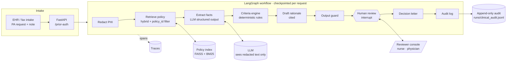
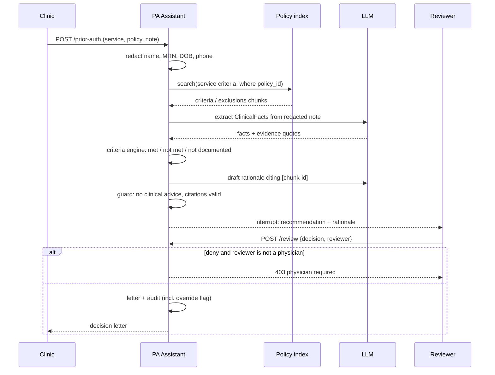

# Capstone 1 — Clinical Prior-Authorization Assistant

> All patients, notes and medical policies are **synthetic**. This is a teaching system, not a medical device or medical advice.

A health-plan utilization-management team receives prior-authorization (PA) requests: a service (for example a lumbar MRI or a GLP-1 drug), a policy, and a free-text clinical note. The assistant prepares each case for a licensed reviewer. It redacts PHI, retrieves the governing policy, extracts clinical facts with evidence, checks every criterion, drafts a cited rationale, and waits for a human decision. Denials require a physician. Everything is audited.

**Autonomy: L2.** The agent recommends and a human decides, always.

**Classes used:** 1 (agent design), 2 (structured output), 3–4 (hybrid retrieval with metadata filter), 5 (interrupts), 7 (evaluation), 11 (guardrails and tracing).

## Architecture



## Process flow



## Decision logic

| Outcome | When | Who can finalise |
|---|---|---|
| approve | All criteria met, or the red-flag pathway | Nurse reviewer |
| pend | A criterion is not documented or not yet met (for example therapy under 6 weeks) | Nurse reviewer |
| redirect | A different service is indicated (for example in-lab sleep study for chronic opioid users) | Nurse reviewer |
| deny | An exclusion is met (MTC/MEN2 history, advanced osteoarthritis) | **Physician only** |

"Not documented" never leads to a denial. It leads to pend.

## Files

| File | Purpose |
|---|---|
| `extraction.py` | `ClinicalFacts` schema; LLM extraction with negation-aware rule fallback |
| `criteria.py` | One deterministic engine per policy; returns criteria, recommendation and reason |
| `graph.py` | LangGraph workflow, human-review interrupt, letter, audit |
| `run.py` | Batch run over all 6 synthetic requests with an accuracy check |
| `api.py` | FastAPI service (submit, get, review) |
| `Dockerfile` | Container image (build from the repository root) |

## Run it

```bash
python -m projects.clinical_prior_auth.run                 # batch, simulated reviewer
python -m projects.clinical_prior_auth.run --interactive   # you are the reviewer
uvicorn projects.clinical_prior_auth.api:app --port 8001   # REST API
docker build -f projects/clinical_prior_auth/Dockerfile -t prior-auth . && docker run -p 8001:8001 prior-auth
```

Offline result: **6/6** recommendations match the expected decisions (approve, pend, approve, deny, redirect, deny). PHI is redacted before any model call in every case.

## Extensions

- Swap `MemorySaver` for a Postgres checkpointer and add a reviewer queue UI.
- Add a FHIR tool that pulls prior PT visits from the EHR, so "pend" cases can resolve automatically.
- Track the reviewer override rate per policy as an online quality metric (it is already in the audit log).
- Add appeal handling as a second graph that reuses the same nodes.
