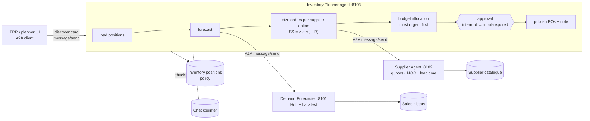
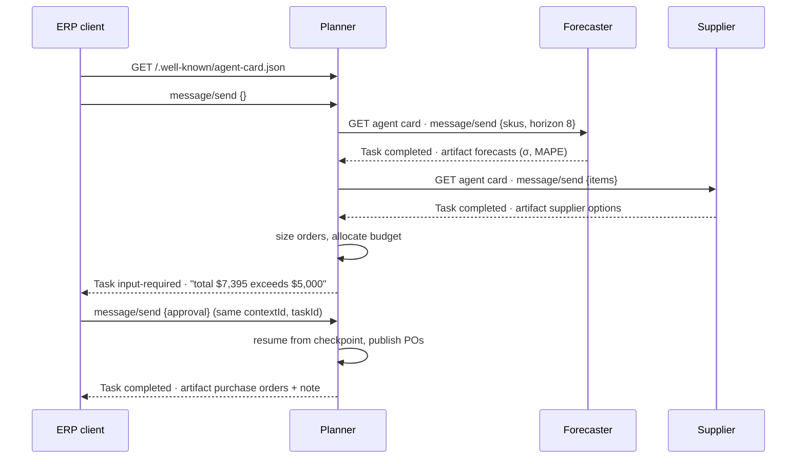

# Capstone 4 — Inventory Planner (multi-agent over A2A)

> Sales history, suppliers and prices are **synthetic** (a hospital medical-supplies store).

Three agents, owned by different teams, collaborate through the **Agent2Agent (A2A) protocol**:

| Agent | Owner | Skill | Serves |
|---|---|---|---|
| Demand Forecaster | Data science | `forecast_demand`: Holt smoothing, grid-searched on a walk-forward backtest; returns forecast, σ and MAPE | :8101 |
| Supplier Agent | Procurement | `quote`: catalogue, MOQ, lead time, reliability-adjusted ranking | :8102 |
| Inventory Planner | Supply chain | `plan_replenishment`: LangGraph orchestration, safety stock, order-up-to, budget, approval | :8103 |

Each agent publishes an **Agent Card** (`/.well-known/agent-card.json`) and accepts JSON-RPC `message/send`. When a plan exceeds the approval threshold, the planner returns task state **`input-required`**. The caller (an ERP, a person, or another agent) replies in the same `contextId` with an approval, and the planner resumes from its LangGraph checkpoint.

**Classes used:** 5 (tools), 6 (checkpointed state), 10 (cost-aware decisions), 11 (tracing and auth), 12 (A2A, deployment, change management).

## Architecture



## Process flow (A2A task lifecycle)



## Planning logic

- Protection period P = supplier lead time L + review period R.
- Safety stock SS = z(service level) × σ_weekly × √P, with z = 1.645 at a 95% service level.
- Order-up-to level S = forecast demand over P + SS. Order = S − (on hand + on order), rounded up to the MOQ.
- **Every supplier option is sized with its own lead time.** A slower, cheaper supplier needs more safety stock, so the planner re-ranks options by total reliability-adjusted cost rather than unit price.
- The budget funds the lowest weeks-of-cover first. The rest is deferred with a reason.
- Plans above the approval threshold pause for a human.

## Result (offline)

| SKU | Cover (weeks) | Order | Supplier | Status |
|---|---|---|---|---|
| Nitrile gloves | 1.7 | 831 | Medlinex (2 wk) | order |
| Surgical masks | 10.7 | 0 | – | above reorder point |
| Syringes 5 ml | 2.1 | 100 (MOQ) | QuickMed (1 wk) | order |
| Gauze pads | 3.1 | 200 | Medlinex | **deferred (budget)** |
| Hand sanitizer | 1.5 | 359 | QuickMed (1 wk) | order |

The total is $7,395 against an $8,000 budget. That exceeds the $5,000 threshold, so the task goes to `input-required`, is approved, and 3 purchase orders are raised.

## Files

| File | Purpose |
|---|---|
| `a2a.py` | Minimal A2A: Agent Card, JSON-RPC `message/send`, Task/Artifact shapes, bearer auth, client |
| `forecaster.py`, `supplier.py` | Specialist agents as A2A servers |
| `planner.py` | LangGraph planner, with an A2A adapter that maps interrupt ↔ `input-required` |
| `run.py` | Starts all three locally and acts as the ERP client (`--reject` to decline) |
| `Dockerfile`, `docker-compose.yml` | One image, three containers |
| `deploy/azure_container_apps.sh` | Azure Container Apps deployment (internal and external ingress, secrets, autoscale) |

## Run it

```bash
python -m projects.inventory_planner.run
python -m projects.inventory_planner.run --reject
docker compose -f projects/inventory_planner/docker-compose.yml up --build
A2A_TOKEN=... ./projects/inventory_planner/deploy/azure_container_apps.sh
```
