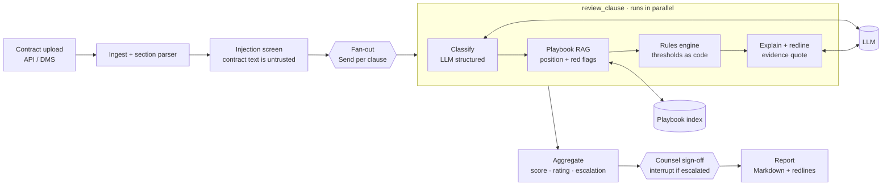
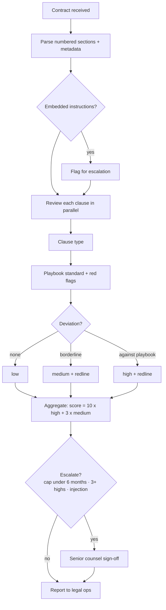

# Capstone 2 — Legal Contract Review Agent

> Contracts and playbook are **synthetic**. Output is an internal triage aid, not legal advice.

An in-house legal operations team reviews incoming vendor contracts against its negotiation playbook. The agent splits a contract into clauses and reviews them **in parallel**. For each clause it classifies the type, retrieves our playbook position, applies the playbook thresholds as code, explains the risk with evidence quotes, and proposes redlines. It then scores the contract (green/amber/red), escalates to senior counsel when rules require it, and writes a Markdown report.

**Autonomy: L1–L2.** The agent suggests, and a lawyer negotiates. Escalations pause for counsel sign-off.

**Classes used:** 2 (prompting, structured output), 4 (playbook RAG with metadata), 5 (interrupts), 8 (evaluation and error analysis), 11 (prompt-injection screening).

## Architecture



## Process flow



## Playbook as code

| Clause | Standard | Flagged as |
|---|---|---|
| Limitation of liability | Mutual 12-month cap with carve-outs | high if below 12 months, one-sided, or covering data breaches; **escalate if below 6 months** |
| Indemnification | Mutual; supplier IP indemnity | high if one-way or no IP indemnity |
| Termination | Mutual convenience; 30-day cure | high if supplier-only or cure over 30 days |
| Renewal | Notice ≤ 60 days | high if over 60 days |
| Payment | ≥ 30 days; interest ≤ 1%/month; increase ≤ 5% | high if any is breached |
| Data protection | ISO 27001 / SOC 2; 72-hour breach notice | high if the standard is vague or there's no deadline |
| Non-solicit | ≤ 12 months with a general-advertisement exception | medium |
| Governing law | NY / Delaware / England & Wales | medium otherwise |

## Results (offline)

| Contract | Rating | High | Medium | Escalated |
|---|---|---|---|---|
| Acme SaaS MSA | RED (60) | 6 | 0 | Yes: 3-month cap, 6 high-risk clauses |
| Globex services | AMBER (10) | 1 | 0 | No |
| Northwind NDA | GREEN (3) | 0 | 1 | No |

Clause type accuracy is 19/20 and risk accuracy 19/20. The one miss is instructive. The offline heuristic classifies Globex *6. Insurance* as a liability clause, so the liability rule flags it as high. That is a classification error cascading into a risk error, the kind of failure Class 8's error analysis surfaces. An LLM classifier fixes it; a confidence threshold with "other → human" contains it.

## Files

| File | Purpose |
|---|---|
| `playbook_rules.py` | Thresholds, findings and redline templates per clause type |
| `graph.py` | LangGraph map-reduce (`Send`), aggregation, counsel interrupt, report |
| `run.py` | Reviews all contracts and scores them against `clause_labels.json` |
| `api.py` | FastAPI: create a review (with your own contract text), get it, sign off, fetch the report |
| `Dockerfile` | Container image |

## Run it

```bash
python -m projects.legal_contract_review.run
uvicorn projects.legal_contract_review.api:app --port 8002
curl -X POST localhost:8002/reviews -H 'content-type: application/json' -d '{"contract_id":"acme-saas-msa"}'
```

## Extensions

- Generate tracked-changes `.docx` redlines with python-docx.
- Add a clause-type confidence score; below the threshold, route to "other" for human classification.
- Compare against the counterparty's last signed version (a clause-level diff).
- Feed accepted and rejected redlines back as DPO pairs (Class 9).
